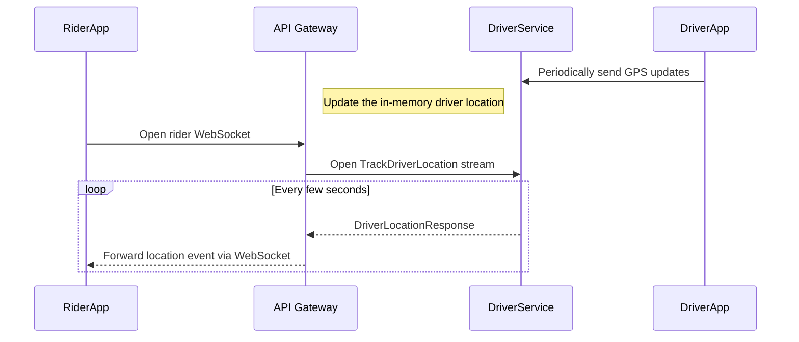

# API Design

Hybrid Logistics Engine uses three API styles together:

- REST for client-triggered request/response operations through the API Gateway.
- WebSockets for rider and driver real-time events.
- gRPC for service-to-service communication and low-latency streaming.

## External Client APIs

The API Gateway exposes REST endpoints for mobile and web clients and keeps long-lived WebSocket connections open for live trip updates.

### REST Response Shape

All REST endpoints return the same JSON envelope.

```json
{
  "data": { "...": "..." },
  "error": {
    "code": "400",
    "message": "Error description"
  }
}
```

### REST Endpoints

#### `POST /trip/preview`

Calculates the route and available fares from pickup to destination.

**Request body**

```json
{
  "userID": "user_123",
  "pickup": {
    "latitude": 37.7749,
    "longitude": -122.4194
  },
  "destination": {
    "latitude": 34.0522,
    "longitude": -118.2437
  }
}
```

**Success response**

```json
{
  "data": {
    "tripID": "preview_xyz",
    "route": {
      "geometry": ["..."],
      "distance": 500.5,
      "duration": 3600
    },
    "rideFares": [
      {
        "id": "fare_abc",
        "userID": "user_123",
        "packageSlug": "standard",
        "totalPriceInCents": 2500
      }
    ]
  }
}
```

#### `POST /trip/start`

Creates a trip from a previously selected fare.

**Request body**

```json
{
  "rideFareID": "fare_abc",
  "userID": "user_123"
}
```

**Success response**

```json
{
  "data": {
    "tripID": "trip_789",
    "trip": {
      "id": "trip_789",
      "status": "searching",
      "userID": "user_123",
      "selectedFare": { "...": "..." },
      "route": { "...": "..." }
    }
  }
}
```

#### `POST /webhook/stripe`

Processes Stripe payment success events. The request must include the `Stripe-Signature` header and the raw Stripe event body so the gateway can verify the webhook and continue trip finalization.

### WebSocket Endpoints

#### `WS /ws/drivers`

Used by driver apps to receive ride requests and send live driver status updates.

#### `WS /ws/riders`

Used by rider apps to receive trip status changes and driver location updates.

**Message shape**

```json
{
  "type": "event_type",
  "data": { "...": "..." }
}
```

## Internal Service APIs

Microservices communicate over gRPC with Protocol Buffers for typed contracts and lower overhead than HTTP JSON.

### Trip Service

`TripService` owns trip preview and trip creation.

```protobuf
syntax = "proto3";

package trip;

service TripService {
  rpc PreviewTrip(PreviewTripRequest) returns (PreviewTripResponse);
  rpc CreateTrip(CreateTripRequest) returns (CreateTripResponse);
}

message PreviewTripRequest {
  string userID = 1;
  Coordinate startLocation = 2;
  Coordinate endLocation = 3;
}

message CreateTripRequest {
  string rideFareID = 1;
  string userID = 2;
}

message PreviewTripResponse {
  string tripID = 1;
  Route route = 2;
  repeated RideFare rideFares = 3;
}

message CreateTripResponse {
  string tripID = 1;
  Trip trip = 2;
}

message Coordinate {
  double latitude = 1;
  double longitude = 2;
}

message Route {
  repeated Geometry geometry = 1;
  double distance = 2;
  double duration = 3;
}

message Geometry {
  repeated Coordinate coordinates = 1;
}

message RideFare {
  string id = 1;
  string userID = 2;
  string packageSlug = 3;
  double totalPriceInCents = 4;
}

message Trip {
  string id = 1;
  RideFare selectedFare = 2;
  Route route = 3;
  string status = 4;
  string userID = 5;
  TripDriver driver = 6;
}

message TripDriver {
  string id = 1;
  string name = 2;
  string profilePicture = 3;
  string carPlate = 4;
}
```

`PreviewTrip` calculates route geometry, distance, duration, and fare options, typically using OSRM-backed routing. `CreateTrip` persists the selected fare and initializes the trip state used by downstream matching and payment flows.

### Driver Service

`DriverService` manages driver availability and location-aware interactions.

```protobuf
syntax = "proto3";

package driver;

service DriverService {
  rpc RegisterDriver(RegisterDriverRequest) returns (RegisterDriverResponse);
  rpc UnregisterDriver(RegisterDriverRequest) returns (RegisterDriverResponse);
  rpc GetAvailableDrivers(GetDriversRequest) returns (GetDriversResponse);
  rpc TrackDriverLocation(TrackDriverRequest) returns (stream DriverLocationResponse);
}

message RegisterDriverRequest {
  string driverID = 1;
  string packageSlug = 2;
}

message RegisterDriverResponse {
  Driver driver = 1;
}

message Driver {
  string id = 1;
  string name = 2;
  string profilePicture = 3;
  string carPlate = 4;
  string geohash = 5;
  string packageSlug = 6;
  Location location = 7;
}

message Location {
  double latitude = 1;
  double longitude = 2;
}

message TrackDriverRequest {
  string driver_id = 1;
  string trip_id = 2;
}

message DriverLocationResponse {
  double latitude = 1;
  double longitude = 2;
  double heading = 3;
}
```

`RegisterDriver` and `UnregisterDriver` manage active driver availability by package. `GetAvailableDrivers` supports dispatch lookups. `TrackDriverLocation` keeps a server-side stream open so the API Gateway can forward fresh driver coordinates to riders without polling.

## Streaming Driver Tracking Flow

When a rider is matched with a driver, the gateway bridges gRPC streaming from Driver Service to the rider WebSocket connection.



This avoids repeated HTTP polling, reduces gateway overhead, and gives riders low-latency map updates once a trip is in progress.
