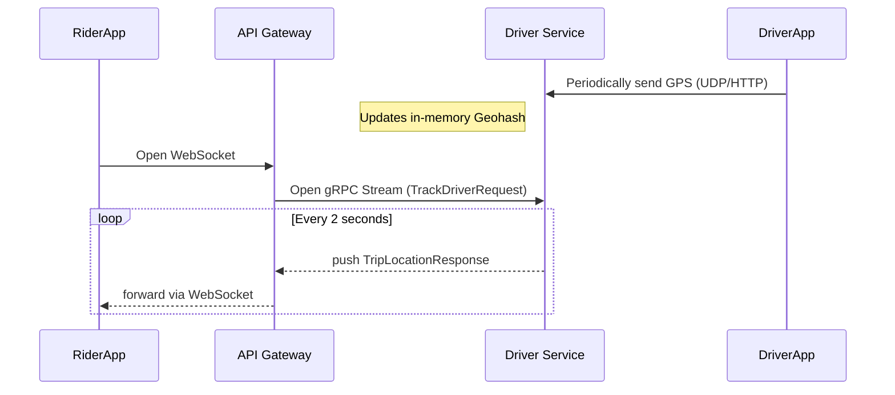

# gRPC Streaming: Real-Time Driver Tracking

*Note: This section covers an optional/advanced architectural extension to the core course curriculum.*

In the standard flow, driver assignment is an asynchronous event. However, once a driver accepts a trip, the rider needs to see the driver's car moving toward them on their map in real-time.

Polling an HTTP endpoint for GPS coordinates every 2 seconds is incredibly inefficient for battery life and server load. Instead, we use **gRPC Streaming**.

## Why gRPC Streaming?

Unlike Unary gRPC (one request, one response), gRPC allows for long-lived, persistent TCP connections where a stream of continuous data can be pushed.

For real-time GPS tracking, we utilize a **Server-Side Stream**.

## The Architecture



## Protocol Buffers Definition

In our `driver.proto`, we define the streaming method using the `stream` keyword on the return type:

```protobuf
service DriverService {
  // Existing unary methods...
  rpc GetAvailableDrivers(GetDriversRequest) returns (GetDriversResponse) {}
  
  // NEW: Server-Side Streaming Method
  rpc TrackDriverLocation(TrackDriverRequest) returns (stream DriverLocationResponse) {}
}

message TrackDriverRequest {
  string driver_id = 1;
  string trip_id = 2;
}

message DriverLocationResponse {
  double latitude = 1;
  double longitude = 2;
  double heading = 3; // Direction car is facing
}
```

## Go Implementation Details

### The Server (Driver Service)
The Driver service implements the stream interface. It enters a `for` loop, repeatedly reading the latest GPS coordinates from its in-memory store, formatting the struct, and calling `stream.Send()`. It gracefully exits if the context is cancelled.

### The Client (API Gateway)
The Gateway acts as the proxy. It calls the gRPC method, receives the streaming client, and enters a `for` loop calling `stream.Recv()`. 

As soon as a new coordinate arrives via gRPC, it immediately writes that JSON payload down the open WebSocket connection to the Rider's phone. This provides ultra-low latency, real-time map updates without HTTP overhead!

## Reference Documentation

- [gRPC Go Quickstart](https://grpc.io/docs/languages/go/quickstart/)

