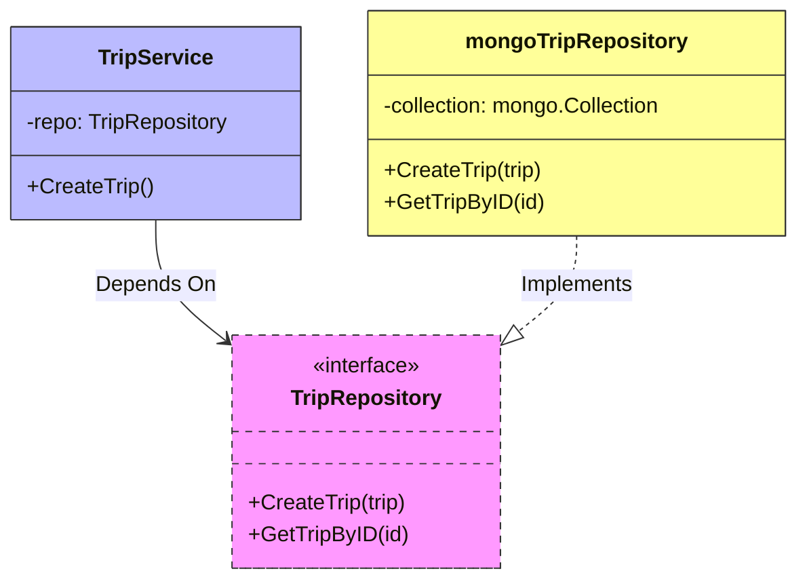
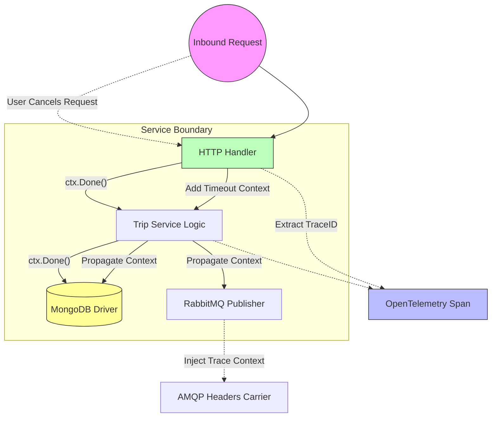
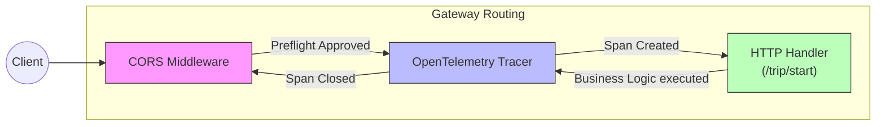

# Design & Implementation Patterns

Because the Hybrid Logistics Engine is built to scale in both traffic and engineering contributors, we adhere to Core **SOLID** principles, the **Repository Pattern**, and strictly idiomatic Go concurrency models.

## 1. Clean Architecture & Repository Pattern

Instead of scattering direct `mongo.Client` queries randomly throughout HTTP handlers or gRPC interceptors, data access is strictly gated behind an interface.

### The Interface Contract

Inside `services/trip-service/internal/domain/trip.go`, we establish a generic interface that is agnostic to the underlying database:

```go
// Domain Layer
type TripRepository interface {
	CreateTrip(ctx context.Context, trip *TripModel) (*TripModel, error)
	GetTripByID(ctx context.Context, id string) (*TripModel, error)
	UpdateTrip(ctx context.Context, trip *TripModel) (*TripModel, error)
}
```

### Liskov Substitution Principle (L)

If S is a subtype of T, then objects of type T may be replaced with objects of type S without altering any of the desirable properties of the program.

Because Go relies on implicit interface satisfaction, Liskov Substitution is achieved naturally. Our `mongoTripRepository` implements the exact `GetTripByID` signature and returns a strictly typed `*domain.TripModel`. If we run automated tests that inject a fake `mockTripRepository` holding dummy memory pointers, the `TripService` behaves identically without ever knowing it isn't talking to MongoDB. They are perfectly substitutable.

### Dependency Inversion Principle (D)

The Trip Service initializes itself by accepting the `domain.TripRepository` interface rather than a concrete struct.



### Single Responsibility Principle (S)

A component should only have one reason to change. 

If we examine the Driver Service, the AMQP consumer (`trip_consumer.go`) has strictly **one** job: Parse RabbitMQ messages off the wire. It absolutely refuses to figure out which driver to pick. It delegates to the core logic!

```go
// trip_consumer.go (Protocol Routing ONLY)
suitableIDs := c.service.FindAvailableDrivers(payload.Trip.SelectedFare.PackageSlug)
```

```go
// service.go (Business Logic ONLY)
func (s *Service) FindAvailableDrivers(packageType string) []string {
	// iterates the memory slice
}
```
By decoupling concerns, an engineer tuning the algorithmic matching process (`service.go`) never risks accidentally breaking AMQP protocol connections.

### Interface Segregation Principle (I)

Clients should not be forced to depend upon interfaces they do not use. 

Go naturally enforces this by allowing consumers to define the smallest possible interface they require. For instance, if a newly created analytics background-worker only needs to fetch trips, we don't pass the giant `TripRepository` interface. We define a targeted one:

```go
// Analytics Service
type TripReader interface {
    GetTripByID(ctx context.Context, id string) (*domain.TripModel, error)
}
```
The MongoDB concrete implementation automatically satisfies this tiny `TripReader` without the Analytics Service ever knowing about or accessing `CreateTrip` or `UpdateTrip` mutations.

### Open/Closed Principle (O)

Software entities (classes, modules, functions, etc.) should be open for extension, but closed for modification.

The exact same `TripRepository` and `domain.PaymentProcessor` interfaces enforce this. If we wish to expand our logistics engine from MongoDB to Postgres, or from Stripe to PayPal, we do **not** need to modify the core `tripService` business logic. Instead, we write a completely new `postgresTripRepository` and pass it into the constructor, extending system capabilities without touching existing, rigorously tested logic.

---

## 2. Go Concurrency & Standardization

### Context Propagation (`context.Context`)

Every HTTP handler, gRPC method, and Database query natively accepts `context.Context` as its very first parameter. This guarantees **three critical capabilities**:



1. **Cancellation**: Triggers mid-flight query cancellation, saving database CPU overhead.
2. **Timeouts**: Wrapped dials (e.g., `context.WithTimeout(..., 5*time.Second)`) prevent offline external services from hanging the thread.
3. **Observability**: Invisibly ferries OpenTelemetry TraceIDs all the way through the HTTP handler, across interceptors, and into RabbitMQ headers.

### Mutex Locking

We strictly use `sync.RWMutex` to guard sensitive mutable states (e.g. tracking thousands of parallel WebSocket connections in the Driver Service).

```go
func (s *Service) RegisterDriver() {
	s.mu.Lock()
	defer s.mu.Unlock() // Guaranteed unlocking precisely when the function returns
    
    // safe to mutate the slice
	s.drivers = append(s.drivers, ...)
}
```

---

## 3. Graceful Server Shutdown

When a service receives an interrupt signal (e.g., from Kubernetes deploying a new version), abruptly terminating drops active connections. Graceful shutdown gives the server time to finish processing in-flight requests.

```go
	shutdown := make(chan os.Signal, 1)
	signal.Notify(shutdown, os.Interrupt, syscall.SIGTERM)

	select {
	case sig := <-shutdown:
		ctx, cancel := context.WithTimeout(context.Background(), 10*time.Second)
		defer cancel()

		if err := server.Shutdown(ctx); err != nil {
			server.Close()
		}
	}
```

By allowing a 10-second contextual limit, we prevent hanging requests from blocking node termination indefinitely.

---

## 4. HTTP Middleware & Multiplexing

### Middleware Request Flow

Middleware handles cross-cutting concerns (CORS, tracing) using standard library function wrapping.



This pattern ensures compliance with W3C Trace Context without modifying every single request handler directly.

### Protocol Multiplexing (`cmux` & `h2c`)

To simplify Kubernetes ingress, we utilize `golang.org/x/net/http2/h2c` to squelch both `gRPC` and `REST` onto a single port.

```go
	multiplexer := h2c.NewHandler(http.HandlerFunc(func(w http.ResponseWriter, r *http.Request) {
		if r.ProtoMajor == 2 && strings.Contains(r.Header.Get("Content-Type"), "application/grpc") {
			grpcServer.ServeHTTP(w, r)
		} else {
			mux.ServeHTTP(w, r)
		}
	}), &http2.Server{})
```
