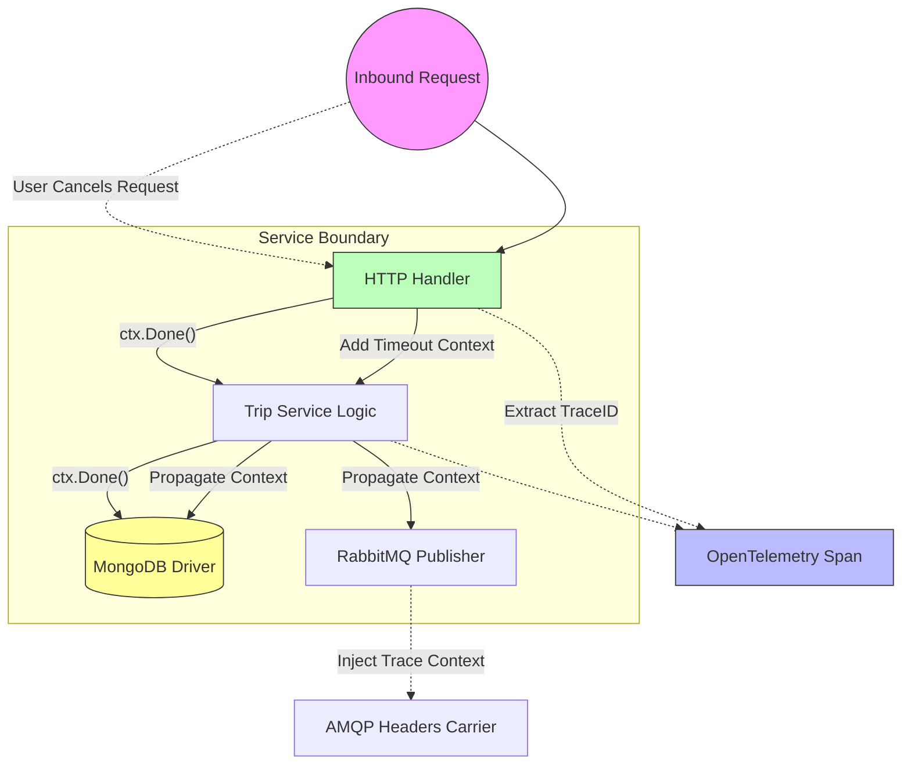

# Go Concurrency & Standardization Patterns

Because the Hybrid Logistics Engine is written exclusively in Go, we heavily utilize standard library idioms rather than importing heavy external frameworks. This keeps binary sizes small, startups fast, and memory predictable.

## 1. Concurrency (Goroutines & Channels)

### Background Workers

Operations that shouldn't block the main server thread are shifted off the thread using `go func()`. An example is consuming RabbitMQ messages. The connection listens endlessly in an asynchronous loop:

```go
// shared/messaging/rabbitmq.go
	go func() {
		for msg := range msgs {
            // Unblocks the main AMQP setup routine.
            // Spools a new context to handle the incoming delivery.
        }
    }()
```

### Mutex Locking

When dealing with high-throughput in-memory state (like thousands of WebSocket connections dropping in and out), slices and maps can easily encounter severe race conditions and runtime panics.

We strictly use `sync.RWMutex` to guard sensitive mutable states.

```go
// services/driver-service/service.go
func (s *Service) RegisterDriver() {
	s.mu.Lock()
	defer s.mu.Unlock() // Guaranteed unlocking precisely when the function returns
    
    // safe to mutate the slice
	s.drivers = append(s.drivers, ...)
}
```

Notice the idiomatic `defer s.mu.Unlock()`. This prevents deadlocks if `append` or sub-functions were to somehow panic.

## 2. Context Propagation (`context.Context`)

Every HTTP handler, gRPC method, and Database query natively accepts `context.Context` as its very first parameter. This guarantees **three critical capabilities**:



1. **Cancellation**: If a rider abruptly closes their application before the `Trip Service` finishes saving to MongoDB, the context triggers a `ctx.Done()`, forcing MongoDB to cancel the query mid-flight, saving database CPU overhead.
2. **Timeouts**: Every API Gateway gRPC client wraps its dial with `context.WithTimeout(..., 5*time.Second)` preventing an offline service from causing infinite hanging on the Gateway.
3. **Observability**: As seen in the Telemetry section, the `ctx` struct invisibly ferries OpenTelemetry TraceIDs all the way through the HTTP handler, across gRPC interceptors, and down into the RabbitMQ headers.

If you break context continuity (`context.Background()` midway), you break cancellation, timeouts, and tracing simultaneously.

## 3. Protocol Multiplexing (`cmux` & `h2c`)

Typically, a microservice binds `REST` to `:8080` and `gRPC` to `:50051`. To simplify Kubernetes ingress and Load Balancing rules, we utilize `golang.org/x/net/http2/h2c` to squelch both protocols into a single port.

```go
// services/trip-service/cmd/main.go
	multiplexer := h2c.NewHandler(http.HandlerFunc(func(w http.ResponseWriter, r *http.Request) {
		if r.ProtoMajor == 2 && strings.Contains(r.Header.Get("Content-Type"), "application/grpc") {
			grpcServer.ServeHTTP(w, r)
		} else {
			mux.ServeHTTP(w, r)
		}
	}), &http2.Server{})
```

This tiny snippet inspects the `Content-Type` header of any incoming TCP connection. If it detects `application/grpc`, it pipes it natively to the `grpc.Server`. Otherwise, it falls back to handling normal health checking REST `/healthz` endpoints.
