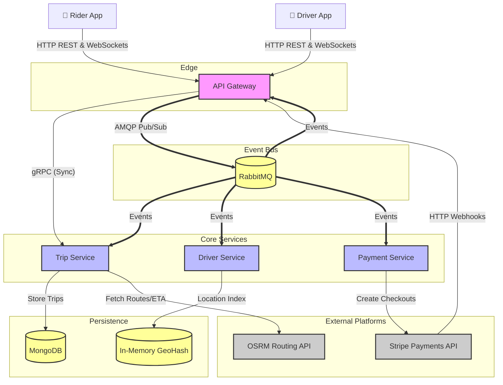
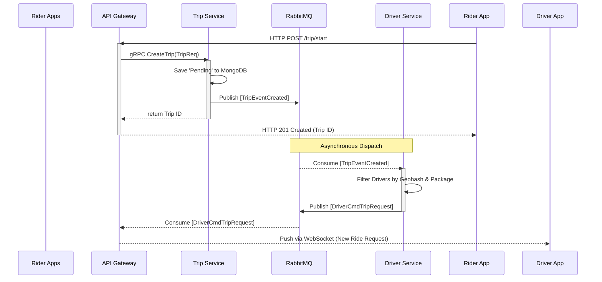
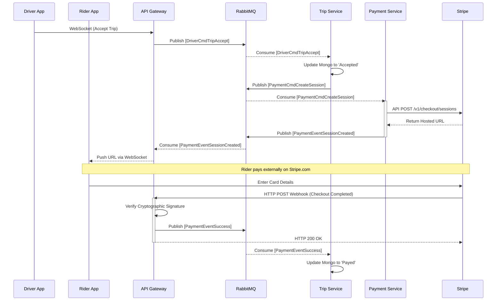

# High-Level Design (HLD): Hybrid Logistics Engine

## 1. Executive Summary
The Hybrid Logistics Engine is a highly scalable, event-driven backend system designed to power a real-time ride-sharing application. It enables riders to request trips, pairs them with available drivers using spatial indexing, and securely processes payments. The system is built using Go microservices, leveraging RabbitMQ for asynchronous messaging, MongoDB for persistent state, and WebSockets for real-time client updates.

**Target Audience:** Engineering Leadership, Product Managers, and Backend Developers.

---

## 2. System Architecture Overview

The system adopts an **Event-Driven Microservices Architecture**. This architecture decouples services using an AMQP message broker (RabbitMQ), ensuring that heavy loads or third-party latencies do not bottleneck the main user-facing APIs.

### Architecture Diagram

### Key Architectural Principles
- **Asynchronous by Default:** Wherever possible, operations are pushed to background queues to return HTTP 200/201 responses to the client instantly.
- **Protocol Multiplexing:** Services expose both gRPC (for strict internal communication) and HTTP/REST (for external client access) on unified ports using `h2c`.
- **Stateless Services:** With the exception of the specialized Driver Service (which uses in-memory indexing for speed), services are stateless and horizontally scalable.
- **Distributed Observability:** Every request is uniquely tagged and traced across service boundaries using OpenTelemetry and Jaeger.

---

## 3. Core Components

The backend is divided into four primary microservices and shared infrastructure:

### 3.1 API Gateway
- **Responsibilities:** Terminates REST/WebSocket connections, proxies synchronous requests (gRPC), handles CORS, upgrades connections, and cryptographically verifies Stripe Webhooks.

### 3.2 Trip Service
- **Responsibilities:** Manages the entire lifecycle workflow of a Trip (`Pending` -> `Accepted` -> `Payed`), calculates distances/ETAs via OSRM, calculates dynamic pricing tiers, and persists canonical state to MongoDB.

### 3.3 Driver Service
- **Responsibilities:** Maintains active drivers using Geohash Spatial Indexing, consumes "Trip Requested" events, and algorithmically matches riders to nearby drivers.

### 3.4 Payment Service
- **Responsibilities:** Securely communicates with Stripe to create Hosted Checkout Sessions asynchronously behind RabbitMQ.

---

## 4. Primary Data Flows

### Flow 1: Trip Request & Dispatch

This is the critical path when a rider taps "Find Ride".

### Flow 2: Acceptance & Payment

This flow triggers when the driver taps "Accept" and the rider fulfills checkout.

---

## 5. Architectural Trade-offs & Decisions

1. **Why Asynchronous Payments?** 
   - *Decision:* Payments are handled via RabbitMQ instead of blocking HTTP calls.
   - *Trade-off:* Adds architectural complexity.
   - *Benefit:* If Stripe's API goes down, the system doesn't crash. Drivers can still accept rides; the payment messages simply queue up and process when Stripe recovers.

2. **In-Memory Driver Indexing vs. Redis:**
   - *Decision:* The Driver Service maps driver locations in memory instead of using Redis `$near` queries.
   - *Benefit:* Infinite horizontal scaling and zero network-hop latency when checking thousands of drivers per second for dispatching.

- [Benefit:] High binary packing efficiency for internal microservice calls while still exposing friendly REST endpoints to the mobile frontend on the exact same port.

## Further Reading

- [Monolith to Microservices (Strangler Fig) - Martin Fowler](https://martinfowler.com/bliki/StranglerFigApplication.html)
- [Microservices Design Principles - Microservices.io](https://microservices.io/patterns/microservices.html)
- [The 12-Factor App Principles](https://12factor.net/)

