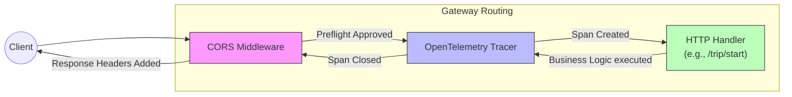

# LLD & Design Patterns

The Hybrid Logistics Engine employs several common Go backend design patterns. This document focuses on request lifecycle management, routing, and proper server teardown strategies.

## Graceful Server Shutdown

When a service receives an interrupt signal (e.g., from Kubernetes deploying a new version), abruptly terminating the process drops active connections. Graceful shutdown gives the HTTP / gRPC server time to finish processing in-flight requests.

### Implementation in API Gateway

In `services/api-gateway/main.go`, we use OS signal notification combined with a context timeout:

```go
	shutdown := make(chan os.Signal, 1)
	signal.Notify(shutdown, os.Interrupt, syscall.SIGTERM)

	select {
	case err := <-serverErrors:
		log.Printf("Error starting the server: %v", err)

	case sig := <-shutdown:
		log.Printf("Server is shutting down due to %v signal", sig)

		ctx, cancel := context.WithTimeout(context.Background(), 10*time.Second)
		defer cancel()

		if err := server.Shutdown(ctx); err != nil {
			log.Printf("Could not stop the server gracefully: %v", err)
			server.Close()
		}
	}
```

By allowing a 10-second contextual limit, we prevent hanging requests from blocking the node termination indefinitely while ensuring no standard response is lost.

## HTTP Middleware Chains

Middleware is crucial for cross-cutting concerns (e.g., observability, CORS) without tightly coupling business logic.

### Middleware Request Flow



In `api-gateway/main.go`, the middleware is structured via standard library function wrapping:

```go
	mux.Handle("/trip/start", tracing.WrapHandlerFunc(enableCORS(handleTripStart), "/trip/start"))
```

### Tracing Middleware Example

The OpenTelemetry wrapper captures all the properties of incoming requests. Located in `shared/tracing/http.go` (and imported manually), this function creates traces before allowing the inner HTTP handler to process logic:

```go
// Example wrapping logic (Internal shared/tracing):
// It creates a span named after the route and injects context down the chain.
func WrapHandlerFunc(next http.HandlerFunc, route string) http.HandlerFunc {
    // Boilerplate for creating a tracer span interceptor ...
}
```

This pattern ensures standard compliance with W3C Trace Context without modifying every individual request handler directly.
