# The Asynchronous Journey (RabbitMQ)

The Hybrid Logistics Engine uses an event-driven architecture. Instead of services waiting synchronously for each other to finish (which causes bottlenecks), they emit events to a central RabbitMQ exchange (`TripExchange`) and immediately return to processing the next request.

Let's walk through the entire lifecycle of a trip, examining exactly how messages bounce between queues behind the scenes.

### Complete Queue Topology

```mermaid
graph TD
    subgraph Exchanges
        TE[TripExchange]
        DLX[DeadLetterExchange]
    end

    subgraph Service Consumers
        AG[API Gateway]
        DS[Driver Service]
        TS[Trip Service]
        PS[Payment Service]
    end

    subgraph Queues
        Q1[FindAvailableDriversQueue]
        Q2[DriverCmdTripRequestQueue]
        Q3[DriverTripResponseQueue]
        Q4[PaymentTripResponseQueue]
        Q5[NotifyPaymentSessionCreatedQueue]
        Q6[NotifyPaymentSuccessQueue]
        Q7[NotifyTripCreatedQueue]
    end

    %% Fanout from TripExchange
    TE --> |"contracts.TripEventCreated"| Q1
    TE --> |"contracts.TripEventCreated"| Q7
    TE --> |"contracts.DriverCmdTripRequest"| Q2
    TE --> |"contracts.*TripAccept/Decline"| Q3
    TE --> |"contracts.PaymentCmdCreateSession"| Q4
    TE --> |"contracts.PaymentEventSessionCreated"| Q5
    TE --> |"contracts.PaymentEventSuccess"| Q6

    %% Consumption
    Q1 --> DS
    Q2 --> AG
    Q3 --> TS
    Q4 --> PS
    Q5 --> AG
    Q6 --> TS
    Q7 --> AG

    %% DLX Retry Policy
    Q1 -.-> |"Reject(requeue=false)"| DLX
    Q2 -.-> DLX
    Q3 -.-> DLX
    Q4 -.-> DLX
    Q5 -.-> DLX
    Q6 -.-> DLX

    style TE fill:#e6b3ff,stroke:#333,stroke-width:2px
    style DLX fill:#ffb366,stroke:#333,stroke-width:2px
    style Queues fill:#85e085,stroke:#333,stroke-width:2px
```

---

## 1. The Rider Requests a Trip

The journey begins when a rider opens the app and hits the **API Gateway**:

1. **Rider -> API Gateway**: Sends an HTTP POST to `/trip/start`.
2. **API Gateway -> Trip Service**: The gateway uses a blocking gRPC call to `CreateTrip()`. Because the rider is waiting for a `TripID` to appear on their screen, this *first* step is synchronous.
3. **Trip Service (RabbitMQ Publish)**: Once the trip is saved to MongoDB in a 'pending' state, the Trip Service fires a message with the routing key `contracts.TripEventCreated`. It then immediately responds to the gRPC call.

## 2. Searching for a Driver

The `TripEventCreated` message lands in multiple queues simultaneously due to RabbitMQ's pub/sub fan-out:

- **Queue 1**: `NotifyTripCreatedQueue` (API Gateway consumes this to push a WebSocket alert to the Rider's screen).
- **Queue 2**: `FindAvailableDriversQueue` (Driver Service consumes this).

The **Driver Service** wakes up:
1. It queries its in-memory list of active drivers, filtering by `PackageSlug`.
2. It randomly selects one isolated driver.
3. It publishes a new message: `contracts.DriverCmdTripRequest`, specifying the chosen `DriverID`.

## 3. The Driver's Phone Rings

That `DriverCmdTripRequest` message goes into the `DriverCmdTripRequestQueue`.
1. The **API Gateway** is listening to this queue.
2. It looks at the message's `DriverID`, searches its internal map of active WebSocket connections, and forwards the JSON payload directly to the driver's phone.
3. The driver's screen now flashes: "New Trip Request - Accept or Decline?".

## 4. The Driver Accepts

The driver taps "Accept" on their phone.
1. Their app sends a WebSocket message back to the **API Gateway**: `contracts.DriverCmdTripAccept`.
2. The Gateway bridges this payload into RabbitMQ via the `DriverTripResponseQueue`.
3. The **Trip Service** consumes this queue. It updates MongoDB to explicitly lock that driver to the trip.
4. The Trip Service then fires `contracts.PaymentCmdCreateSession`.

## 5. Taking to Checkout

Notice how the Trip Service doesn't talk to Stripe? It delegates!
1. The **Payment Service** consumes the `PaymentCmdCreateSession` from the `PaymentTripResponseQueue`.
2. It dials Stripe asynchronously to generate a Hosted Checkout Session.
3. It replies with `contracts.PaymentEventSessionCreated`.
4. The **API Gateway** consumes this and pushes the URL down the Rider's WebSocket, redirecting their browser to pay.

## 6. The Webhook Conclusion

1. The Rider pays successfully on Stripe's website.
2. Stripe sends an HTTP POST Webhook to the **API Gateway**.
3. The Gateway does cryptographic signature verification. If successful, it publishes the final `contracts.PaymentEventSuccess`.
4. The **Trip Service** consumes this, marking the trip `payed` in MongoDB. The journey is complete.

---

## 7. RabbitMQ Queue Registry

The system relies on dedicated RabbitMQ queues to handle all events. Below is an exhaustive list.

### Trip & Driver Search (4 Queues)
1. **`find_available_drivers`**: Backbone of the matching engine. It receives `TripEventCreated` and `TripEventDriverNotInterested` events. The driver service processes this queue to locate the next available matching driver. (120s TTL)
2. **`search_retry_queue`**: Implements the interval driver search headless wait queue with a strict 10s TTL. When a message expires here, it routes back to the main `TripExchange`.
3. **`driver_cmd_trip_request`**: Carries direct command payloads addressed to a specific Driver ID to offer them a ride. API Gateway pushes this to Websockets.
4. **`driver_trip_response`**: The inbound pipe from the drivers. API gateway pushes "Accept/Decline" clicks so the Trip service can lock the trip.

### API Gateway / WebSocket Notifications (4 Queues)
5. **`notify_trip_created`**: Signals to the rider UI that the trip has begun the distributed driver search successfully. 
6. **`notify_driver_assign`**: Sends an alert to the rider UI that a driver has successfully accepted their ride request, providing driver details (name, car, ETA).
7. **`notify_driver_no_drivers_found`**: Specifically handles the frontend alert triggered when the matching engine exhausts all active drivers (or the DLQ handles a timeout) and gives up.
8. **`dead_letter_queue`**: The ultimate fallback sink for expired or rejected messages. Handled by `dlq_consumer.go` to dispatch fail-over WebSockets.

### Payment Workflows (3 Queues)
9. **`payment_trip_response`**: Informs the payment service that a driver has locked a trip, triggering the initial setup of a Stripe checkout session based on the agreed fare.
10. **`notify_payment_session_created`**: Receives the async Stripe URL. Push into the rider's UI to redirect.
11. **`payment_success`**: Handles validated incoming Stripe Webhooks to unlock the MongoDB status to "Payed".

---

## 8. Reliability & TTL Strategy

When drivers frequently disconnect or go offline improperly, stale data can accumulate in memory. To resolve this, the RabbitMQ setup utilizes **Dead Letter Exchanges (DLX)** and **Message TTLs (Time-To-Live)** across the entire registry.

### Stale Data Prevention
If an event like `trip.requested` sits in `find_available_drivers` for too long (120s) without being consumed or correctly handled, it is automatically dropped from the main flow and forwarded to the DLQ. This prevents the system from attempting to match riders with drivers using outdated "ghost" requests that are no longer valid.

### Headless Wait Queues
The use of `search_retry_queue` as a headless wait queue allows the system to implement a "retry loop" natively in the message broker, keeping the microservices stateless and preventing them from having to manage complex internal timers for search intervals.

---

### External Resources
- [RabbitMQ Tutorial: Publish/Subscribe (Go)](https://www.rabbitmq.com/tutorials/tutorial-three-go)
- [AMQP Best Practices: Queue/Topic Design - Stack Overflow](https://stackoverflow.com/questions/32220312/rabbitmq-amqp-best-practice-queue-topic-design-in-a-microservice-architecture)
