# The Asynchronous Journey

The Hybrid Logistics Engine uses an event-driven architecture. Instead of services waiting synchronously for each other to finish (which causes bottlenecks), they emit events to a central RabbitMQ exchange (`TripExchange`) and immediately return to processing the next request.

Let's walk through the entire lifecycle of a trip, examining exactly how messages bounce between queues behind the scenes.

### Complete Queue Topology

```mermaid
graph TD
    subgraph Exchanges
        TE[TripExchange]
        DLX[DeadLetterExchange]
    end

    subgraph Service Consumers
        AG[API Gateway]
        DS[Driver Service]
        TS[Trip Service]
        PS[Payment Service]
    end

    subgraph Queues
        Q1[FindAvailableDriversQueue]
        Q2[DriverCmdTripRequestQueue]
        Q3[DriverTripResponseQueue]
        Q4[PaymentTripResponseQueue]
        Q5[NotifyPaymentSessionCreatedQueue]
        Q6[NotifyPaymentSuccessQueue]
        Q7[NotifyTripCreatedQueue]
    end

    %% Fanout from TripExchange
    TE --> |"contracts.TripEventCreated"| Q1
    TE --> |"contracts.TripEventCreated"| Q7
    TE --> |"contracts.DriverCmdTripRequest"| Q2
    TE --> |"contracts.*TripAccept/Decline"| Q3
    TE --> |"contracts.PaymentCmdCreateSession"| Q4
    TE --> |"contracts.PaymentEventSessionCreated"| Q5
    TE --> |"contracts.PaymentEventSuccess"| Q6

    %% Consumption
    Q1 --> DS
    Q2 --> AG
    Q3 --> TS
    Q4 --> PS
    Q5 --> AG
    Q6 --> TS
    Q7 --> AG

    %% DLX Retry Policy
    Q1 -.-> |"Reject(requeue=false)"| DLX
    Q2 -.-> DLX
    Q3 -.-> DLX
    Q4 -.-> DLX
    Q5 -.-> DLX
    Q6 -.-> DLX

    style TE fill:#e6b3ff,stroke:#333,stroke-width:2px
    style DLX fill:#ffb366,stroke:#333,stroke-width:2px
    style Queues fill:#85e085,stroke:#333,stroke-width:2px
```

---

## 1. The Rider Requests a Trip

The journey begins when a rider opens the app and hits the **API Gateway**:

1. **Rider -> API Gateway**: Sends an HTTP POST to `/trip/start`.
2. **API Gateway -> Trip Service**: The gateway uses a blocking gRPC call to `CreateTrip()`. Because the rider is waiting for a `TripID` to appear on their screen, this *first* step is synchronous.
3. **Trip Service (RabbitMQ Publish)**: Once the trip is saved to MongoDB in a 'pending' state, the Trip Service fires a message with the routing key `contracts.TripEventCreated`. It then immediately responds to the gRPC call.

## 2. Searching for a Driver

The `TripEventCreated` message lands in multiple queues simultaneously due to RabbitMQ's pub/sub fan-out:

- **Queue 1**: `NotifyTripCreatedQueue` (API Gateway consumes this to push a WebSocket alert to the Rider's screen).
- **Queue 2**: `FindAvailableDriversQueue` (Driver Service consumes this).

The **Driver Service** wakes up:
1. It queries its in-memory list of active drivers, filtering by `PackageSlug`.
2. It randomly selects one isolated driver.
3. It publishes a new message: `contracts.DriverCmdTripRequest`, specifying the chosen `DriverID`.

## 3. The Driver's Phone Rings

That `DriverCmdTripRequest` message goes into the `DriverCmdTripRequestQueue`.
1. The **API Gateway** is listening to this queue.
2. It looks at the message's `DriverID`, searches its internal map of active WebSocket connections, and forwards the JSON payload directly to the driver's phone.
3. The driver's screen now flashes: "New Trip Request - Accept or Decline?".

## 4. The Driver Accepts

The driver taps "Accept" on their phone.
1. Their app sends a WebSocket message back to the **API Gateway**: `contracts.DriverCmdTripAccept`.
2. The Gateway bridges this payload into RabbitMQ via the `DriverTripResponseQueue`.
3. The **Trip Service** consumes this queue. It updates MongoDB to explicitly lock that driver to the trip.
4. The Trip Service then fires `contracts.PaymentCmdCreateSession`.

## 5. Taking to Checkout

Notice how the Trip Service doesn't talk to Stripe? It delegates!
1. The **Payment Service** consumes the `PaymentCmdCreateSession` from the `PaymentTripResponseQueue`.
2. It dials Stripe asynchronously to generate a Hosted Checkout Session.
3. It replies with `contracts.PaymentEventSessionCreated`.
4. The **API Gateway** consumes this and pushes the URL down the Rider's WebSocket, redirecting their browser to pay.

## 6. The Webhook Conclusion

1. The Rider pays successfully on Stripe's website.
2. Stripe sends an HTTP POST Webhook to the **API Gateway**.
3. The Gateway does cryptographic signature verification. If successful, it publishes the final `contracts.PaymentEventSuccess`.
4. The **Trip Service** consumes this, marking the trip `payed` in MongoDB. The journey is complete.

---

### Why so many queues?
By isolating responsibilities, if the `Payment Service` crashes while dialing Stripe, only the `PaymentTripResponseQueue` backs up. The `Driver Service` can continue churning through thousands of new trip dispatches completely unaffected. When the Payment Service reboots, it simply picks up right where it left off!

## RabbitMQ Resources

- [RabbitMQ Tutorial: Hello World (Go)](https://www.rabbitmq.com/tutorials/tutorial-one-go)
- [RabbitMQ Tutorial: Publish/Subscribe (Go)](https://www.rabbitmq.com/tutorials/tutorial-three-go)
- [AMQP Best Practices: Queue/Topic Design - Stack Overflow](https://stackoverflow.com/questions/32220312/rabbitmq-amqp-best-practice-queue-topic-design-in-a-microservice-architecture)

