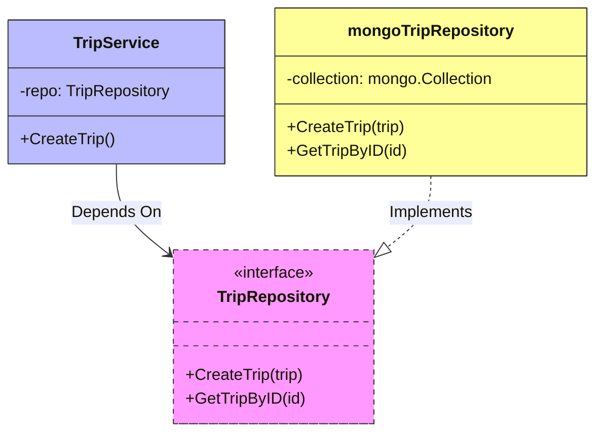

# Clean Architecture in Go

The Hybrid Logistics Engine is built to scale not just in traffic, but in engineering contributors. To ensure the codebase remains maintainable, strictly testable, and robust, we adhere to Core **SOLID** principles alongside the **Repository Pattern**.

---

## The Repository Pattern

Instead of scattering direct `mongo.Client.Database("trips").Collection("trips").InsertOne()` calls randomly throughout HTTP handlers or gRPC interceptors, data access is strictly gated behind an interface.

### The Interface Contract

Inside `services/trip-service/internal/domain/trip.go`, we establish a generic interface that has absolutely zero knowledge of "MongoDB" or "Postgres":

```go
// Domain Layer
type TripRepository interface {
	CreateTrip(ctx context.Context, trip *TripModel) (*TripModel, error)
	GetTripByID(ctx context.Context, id string) (*TripModel, error)
	UpdateTrip(ctx context.Context, trip *TripModel) (*TripModel, error)
}
```

### The Concrete Implementation

We then map these abstract methods to actual `mongo-driver` queries inside `services/trip-service/internal/repository/mongo.go`.

```go
// Infrastructure Layer
type tripRepository struct {
	collection *mongo.Collection
}

func (r *tripRepository) CreateTrip(ctx context.Context, trip *domain.TripModel) (*domain.TripModel, error) {
	_, err := r.collection.InsertOne(ctx, trip)
	return trip, err
}
```

**Why do this?** If we realize Redis is faster and want to migrate `GetTripByID` to a cache tomorrow, we literally do not have to rewrite a single line of business logic. We just swap the underlying struct that satisfies the `TripRepository` interface.

---

## SOLID Principles in Action

### Dependency Inversion (D)

*"Depend upon abstractions, not concretions."* 

Look closely at how the Trip Service initializes itself. It does not accept a `*mongo.Collection`. It accepts the `domain.TripRepository` interface. 



```go
type tripService struct {
	repo             domain.TripRepository
	paymentProcessor domain.PaymentProcessor
}

func NewTripService(repo domain.TripRepository) domain.Service {
	return &tripService{
		repo: repo,
	}
}
```

**Testing Benefits:** We can now instantly inject a mock struct `mockTripRepo{}` into the `NewTripService()` function to run instantaneous Unit Tests entirely offline.

### Single Responsibility (S)

A component should only have one reason to change. 

If we examine the `Driver Service`, the `trip_consumer.go` has only **one** job: Parse RabbitMQ messages off the wire. Once it deserializes the payload, it absolutely refuses to figure out which driver to pick. It delegates!

```go
// trip_consumer.go (Amqp Logic ONLY)
suitableIDs := c.service.FindAvailableDrivers(payload.Trip.SelectedFare.PackageSlug)

// service.go (Business Logic ONLY)
func (s *Service) FindAvailableDrivers(packageType string) []string {
	// iterates the memory slice
}
```

By decoupling these concerns, an engineer tuning the algorithmic matching process (`service.go`) never risks accidentally breaking AMQP protocol connections (`trip_consumer.go`).
