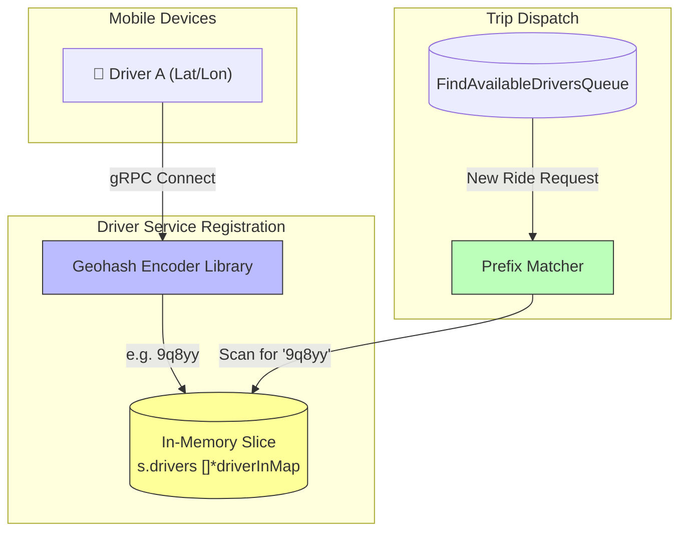

# Spatial Indexing & State Management

The Hybrid Logistics Engine has a requirement for very fast real-time tracking of drivers. To handle thousands of location updates per second, we avoid storing highly mutable driver state directly into MongoDB.

## In-Memory Driver State

The **Driver Service** keeps its driver data entirely in-memory. This acts essentially as a cache, drastically dropping latency for proximity lookups.

### Geohash Mapping Flow



```go
type Driver struct {
    ID              string
    Name            string
    ProfilePicture  string
    CarPlate        string
    Geohash         string    // For spatial indexing
    PackageSlug     string    // Vehicle type offered
    Location        struct {
        Latitude  float64
        Longitude float64
    }
}
```

Notice the use of the `Geohash` string. Instead of calculating the Haversine distance for every single driver on every trip request, the location coordinates are encoded into Geohashes. When a trip request comes in from the Trip Service, the Driver Service performs string prefix matching to find active drivers within the same spatial bucket.

## TTL Events and Cleanup

When drivers frequently disconnect or go offline improperly, stale data can accumulate in memory. 

To resolve this, the RabbitMQ setup utilizes Dead Letter Exchanges (DLX) and message TTLs (Time-To-Live). If an event like `trip.event.created` sits in `find_available_drivers` for too long without being consumed or correctly handled, it is dropped or forwarded to a retry mechanism rather than persisting indefinitely and blocking the system.
