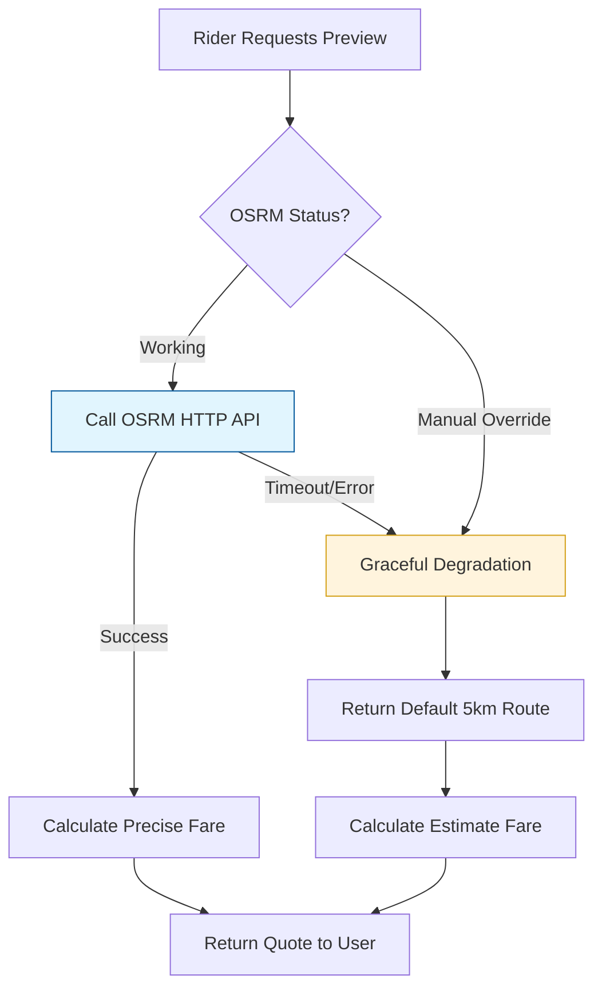

# API Gateway

The API Gateway is the central entry point for all frontend traffic. It manages connection security, WebSocket multiplexing, external API resiliency, and graceful shutdown orchestration.

## 1. WebSockets

The API Gateway provides real-time bidirectional communication using WebSockets. This is crucial for keeping both drivers and riders updated with live trip events, location tracking, and dispatching.

### Connection Management

The `connManager` (a `ConnectionManager` from `shared/messaging`) handles upgrading HTTP requests to WebSocket connections and managing active client sessions.

```go
var (
	connManager = messaging.NewConnectionManager()
)
```

**Upgrading the Connection:** When a client hits the `/ws/riders` or `/ws/drivers` endpoints, the HTTP connection is upgrade,:

```go
func handleRidersWebSocket(w http.ResponseWriter, r *http.Request, rb *messaging.RabbitMQ) {
	conn, err := connManager.Upgrade(w, r)
	if err != nil {
		log.Printf("WebSocket upgrade failed: %v", err)
		return
	}

	defer conn.Close()
	// ...
```

The `userID` is extracted from the query parameters to uniquely identify the connection. If successful, the connection is added to the connection manager:

```go
	userID := r.URL.Query().Get("userID")
	if userID == "" {
		log.Println("No user ID provided")
		return
	}

	// Add connection to manager
	connManager.Add(userID, conn)
	defer connManager.Remove(userID)
```


### Bridging WebSockets and RabbitMQ

A major feature of the API Gateway is bridging synchronous WebSocket connections with asynchronous RabbitMQ message queues.

**Consuming Messages:** For a rider connection, the gateway initializes queue consumers that listen for events related to that rider and push them down the specific WebSocket connection:

```go
	// Initialize queue consumers
	queues := []string{
		messaging.NotifyDriverNoDriversFoundQueue,
		messaging.NotifyDriverAssignQueue,
		messaging.NotifyPaymentSessionCreatedQueue,
		messaging.NotifyTripCreatedQueue,
	}

    for _, q := range queues {
		go func(queueName string) {
			msgs, err := rb.ConsumeMessages(queueName, userID)
			if err != nil {
				log.Printf("Failed to start consuming from %s: %v", queueName, err)
				return
			}
// ...
```

**Publishing Messages:** When the gateway receives a message from a driver over the WebSocket connection (like accepting or declining a trip), it parses it and publishes it back into RabbitMQ to be handled asynchronously by the Driver Service.


```go
		var driverMsg driverMessage
		if err := json.Unmarshal(message, &driverMsg); err != nil {
			log.Printf("Error unmarshaling driver message: %v", err)
			continue
		}

		// Handle the different message type
		switch driverMsg.Type {
		case contracts.DriverCmdLocation:
			// Handle driver location update in the future
			continue
		case contracts.DriverCmdTripAccept, contracts.DriverCmdTripDecline:
			// Forward the message to RabbitMQ
			if err := rb.PublishMessage(ctx, driverMsg.Type, contracts.AmqpMessage{
				OwnerID: userID,
				Data:    driverMsg.Data,
			}); err != nil {
				log.Printf("Error publishing message to RabbitMQ: %v", err)
			}
		default:
			log.Printf("Unknown message type: %s", driverMsg.Type)
		}
```

### Driver Registration via gRPC

For drivers, connecting to the WebSocket also triggers a gRPC call to register them as available in the internal system:

```go
	driverService, err := grpc_clients.NewDriverServiceClient()
	// ...
	driverData, err := driverService.Client.RegisterDriver(ctx, &driver.RegisterDriverRequest{
		DriverID:    userID,
		PackageSlug: packageSlug,
	})
```

Upon WebSocket disconnection, a deferred function automatically calls the gRPC `UnregisterDriver` endpoint to remove the driver from the available pool:

```go
	// Closing connections
	defer func() {
		connManager.Remove(userID)

		driverService.Client.UnregisterDriver(ctx, &driver.RegisterDriverRequest{
			DriverID:    userID,
			PackageSlug: packageSlug,
		})

		driverService.Close()
		log.Println("Driver unregistered: ", userID)
	}()
```


---

## 2. CORS Middleware

The API Gateway utilizes custom middleware to handle Cross-Origin Resource Sharing (CORS). This allows the frontend to communicate with the API Gateway without being blocked by the browser.

### Middleware Implementation

The implementation is a straightforward HTTP handler wrapper found in `services/api-gateway/middleware.go`. When browsers prepare to make cross-origin requests, they first send an HTTP `OPTIONS` request known as a preflight request. The middleware detects this and responds with a `200 OK` without passing the request down to the actual business logic handler.

```go
func enableCORS(handler http.HandlerFunc) http.HandlerFunc {
	return func(w http.ResponseWriter, r *http.Request) {
		w.Header().Set("Access-Control-Allow-Origin", "*")
		w.Header().Set("Access-Control-Allow-Methods", "GET, POST, PUT, DELETE, OPTIONS")
		w.Header().Set("Access-Control-Allow-Headers", "Content-Type, Authorization")
		if r.Method == "OPTIONS" {
			w.WriteHeader(http.StatusOK)
			return
		}
		handler(w, r)
	}
}
```

#### Preflight Requests

When browsers prepare to make cross-origin requests, they first send an HTTP `OPTIONS` request known as a preflight request. The middleware detects this and responds with a `200 OK` without passing the request down to the actual business logic handler.

```go
		// allow preflight requests from the browser API
		if r.Method == "OPTIONS" {
			w.WriteHeader(http.StatusOK)
			return
		}
```

## Applying the Middleware

In `main.go`, the `enableCORS` middleware is wrapped around the endpoints that require it, often chained together with other middleware like tracing:

```go
	mux.Handle("/trip/preview", tracing.WrapHandlerFunc(enableCORS(handleTripPreview), "/trip/preview"))
	mux.Handle("/trip/start", tracing.WrapHandlerFunc(enableCORS(handleTripStart), "/trip/start"))
```

> [!WARNING]
> In this implementation, `Access-Control-Allow-Origin` is set to `*`. While acceptable for development, a hardened production setup should restrict this to specific trusted domains.


---

## 3. Graceful Shutdown

To prevent dropping active connections or interrupting in-flight requests during deployments or scale-downs, the API Gateway implements a graceful shutdown routine.

### Signal Handling & Orchestration

The server listens for operating system interrupt signals (`SIGINT` and `SIGTERM`) instead of crashing immediately. A `select` block handles either server startup errors or the interception of a shutdown signal.

```go
	shutdown := make(chan os.Signal, 1)
	signal.Notify(shutdown, os.Interrupt, syscall.SIGTERM)

	select {
	case err := <-serverErrors:
		log.Printf("Error starting the server: %v", err)
	case sig := <-shutdown:
		log.Printf("Server is shutting down due to %v signal", sig)
		ctx, cancel := context.WithTimeout(context.Background(), 10*time.Second)
		defer cancel()
		if err := server.Shutdown(ctx); err != nil {
			log.Printf("Could not stop the server gracefully: %v", err)
			server.Close()
		}
	}
```

A background context is created with a strict 10-second timeout. Valid active requests finish natively, but if they take longer than 10 seconds, the context expires, forcing the remaining hanging connections closed.


> [!NOTE]
> This pattern is applied across all microservices to ensure reliable deployments and avoid frustrating client-side errors when pods restart.

---

## 4. Preparing for External API Failures

Microservices rarely live in a vacuum. The RideSync heavily relies on external dependencies like OSRM (Open Source Routing Machine) to calculate geographical data.

### The Fallback Pattern

In our `Trip Service`, we've implemented a robust pattern to handle OSRM downtimes. The `GetRoute` function accepts a `useOSRMApi` boolean. This allows us to toggle between the real external API and a "Graceful Degradation" mock.

```go
func (s *service) GetRoute(ctx context.Context, pickup, destination *types.Coordinate, useOSRMApi bool) (*tripTypes.OsrmApiResponse, error) {
	if !useOSRMApi {
		// GRACEFUL DEGRADATION: Return a simple mock response
		// This prevents the whole system from crashing if OSRM is down
		return &tripTypes.OsrmApiResponse{ /* ... default 5km / 10min values ... */ }, nil
	}
	// REAL API CALL
}
```

### Manual Circuit Breaking

In the gRPC Handler, we have a clear manual switch. If an engineer sees high latency or 503 errors from OSRM, they can quickly flip this value to `false` and restart the service to stabilize the system.



### Context Propagation via `http.NewRequestWithContext`

When a rider cancels their trip preview (e.g., closes the app), the inbound gRPC context is cancelled. Previously, the OSRM `http.Get` call was disconnected from this context and would keep running for up to 10 seconds, wasting server resources.

The `GetRoute` function now uses `http.NewRequestWithContext` to bind the outbound OSRM request directly to the incoming context:

```go
req, err := http.NewRequestWithContext(ctx, http.MethodGet, url, nil)
if err != nil {
    return nil, fmt.Errorf("failed to create OSRM request: %w", err)
}
client := &http.Client{Timeout: 10 * time.Second}
resp, err := client.Do(req)
```

This means:
- If the **rider cancels**: the context is cancelled → `client.Do(req)` returns immediately with `context.Canceled`.
- If the **OSRM API hangs**: the `10s` wall-clock timeout on `http.Client` fires as a safety net.

Both signals are handled gracefully by the same error path.

---

## Further Reading & Resources
- [MDN WebSockets API Reference](https://developer.mozilla.org/en-US/docs/Web/API/WebSockets_API)
- [Gorilla WebSocket Documentation](https://pkg.go.dev/github.com/gorilla/websocket#section-readme)
- [What is CORS? - AWS](https://aws.amazon.com/what-is/cross-origin-resource-sharing/)
- [OSRM API Documentation](https://project-osrm.org/docs/v5.24.0/api/#route-service)
- [K8s Terminating with Grace](https://cloud.google.com/blog/products/containers-kubernetes/kubernetes-best-practices-terminating-with-grace)
