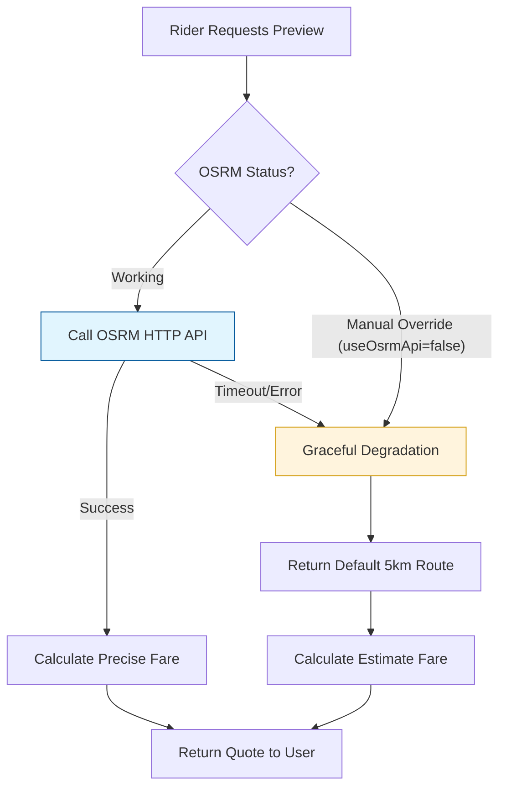

# Preparing for External API Failures

Microservices rarely live in a vacuum. The Hybrid Logistics Engine heavily relies on two major external dependencies:
1. **OSRM (Open Source Routing Machine)**: For calculating trip distances, durations, and polyline geometries.
2. **Stripe**: For processing payments.

## Implementation in the Codebase

In our `Trip Service`, we've implemented a robust pattern to handle OSRM downtimes.

### 1. The Fallback Pattern

In `services/trip-service/internal/service/service.go`, the `GetRoute` function accepts a `useOSRMApi` boolean. This allows us to toggle between the real external API and a "Graceful Degradation" mock.

```go
func (s *service) GetRoute(ctx context.Context, pickup, destination *types.Coordinate, useOSRMApi bool) (*tripTypes.OsrmApiResponse, error) {
	if !useOSRMApi {
		// GRACEFUL DEGRADATION: Return a simple mock response
		// This prevents the whole system from crashing if OSRM is down
		return &tripTypes.OsrmApiResponse{
			Routes: []struct {
				Distance float64 `json:"distance"`
				Duration float64 `json:"duration"`
                // ... setup geometry ...
			}{
				{
					Distance: 5.0, // Default 5km
					Duration: 600, // Default 10 minutes
					Geometry: // ... coordinates ...
				},
			},
		}, nil
	}

	// REAL API CALL:
	baseURL := env.GetString("OSRM_API", "http://router.project-osrm.org")
    // ... logic to build URL and call http.Get(url) ...
}
```

### 2. Manual Circuit Breaking

In the gRPC Handler (`services/trip-service/internal/infrastructure/grpc/grpc_handler.go`), we have a clear manual switch. If an engineer sees high latency or 503 errors from OSRM, they can quickly flip this value to `false` and restart the service to stabilize the system.

```go
func (h *gRPCHandler) PreviewTrip(ctx context.Context, req *pb.PreviewTripRequest) (*pb.PreviewTripResponse, error) {
    // ... setup coordinates ...

	// CHANGE THE LAST ARG TO "FALSE" if the OSRM API is not working right now
	route, err := h.service.GetRoute(ctx, pickupCoord, destinationCoord, true)
	if err != nil {
		log.Println(err)
		return nil, status.Errorf(codes.Internal, "failed to get route: %v", err)
	}
    // ... continue ...
}
```

## Resiliency Flow Diagram

The following diagram illustrates how the system recovers when OSRM is unreachable:



## Best Practice: Context Timeouts

While we currently pass a `context.Context` to `GetRoute`, a critical upcoming improvement is to use `http.NewRequestWithContext` instead of basic `http.Get`. This ensures that if the rider cancels their request on the app, the Trip Service immediately terminates its pending OSRM network call, saving bandwidth and server resources.

```go
// Recommended Improvement:

## External Resources

- [OSRM API Documentation](https://project-osrm.org/docs/v5.24.0/api/#route-service)
- [K8s Best Practices: Terminating with Grace - Google Cloud](https://cloud.google.com/blog/products/containers-kubernetes/kubernetes-best-practices-terminating-with-grace)

