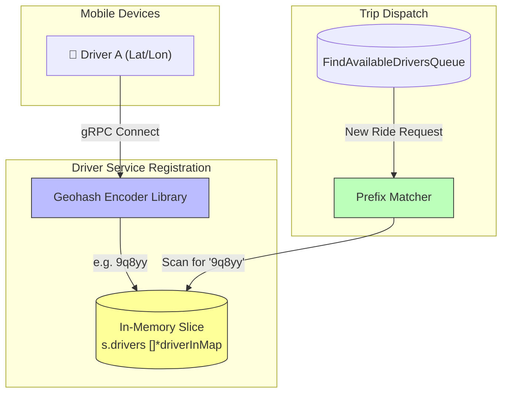

# Driver Service

The Driver Service is an in-memory, stateful microservice responsible for managing the active driver pool and executing the ride-matching dispatch loop.

## 1. Geohash Spatial Indexing

To efficiently match dispatch requests with nearby drivers, the service uses Geohashes before falling back to exact coordinate bounding-box math.

#### The Problem

Searching for drivers using raw Latitude and Longitude float coordinates across thousands of active vehicles requires intense database querying (e.g., "$near" MongoDB operators) which often bottlenecks high-throughput ride-sharing platforms.

#### The Solution

A Geohash combines longitude and latitude into a single alphanumeric string. Locations that are nearby share the same prefix. When a driver registers, their exact coordinate is immediately encoded using `github.com/mmcloughlin/geohash`:

```go
import "github.com/mmcloughlin/geohash"

lat := randomRoute[0][0]
lon := randomRoute[0][1]
geohashStr := geohash.Encode(lat, lon)

driver := &pb.Driver{
	Id:          driverId,
	Geohash:     geohashStr,
	Location:    &pb.Location{Latitude: lat, Longitude: lon},
	PackageSlug: packageSlug,
}
```

The encoded `Geohash` is maintained on the `Driver` object to support scalable `$prefix` checks over Redis or MongoDB in production. For example, asking for drivers near Geohash `9q8yy` instantly pulls all records starting with `9q8yy`, returning nearby cars in O(1) string-matching time.

---

## 2. Driver State Management

The RideSync has a requirement for very fast real-time tracking of drivers. To handle thousands of location updates per second, we avoid storing highly mutable driver state directly into MongoDB.

### In-Memory Driver State

The **Driver Service** keeps its driver data entirely in-memory. This acts essentially as a cache, drastically dropping latency for proximity lookups.

#### Geohash Mapping Flow



With multiple parallel WebSockets connecting or disconnecting at random, the Driver Service (maintains an array of pointers to driverInMap) implements thread-safe state management using `sync.RWMutex`.

```go
type Driver struct {
    ID              string
    Name            string
    ProfilePicture  string
    CarPlate        string
    Geohash         string    // For spatial indexing
    PackageSlug     string    // Vehicle type offered
    Location        struct {
        Latitude  float64
        Longitude float64
    }
}
```

Notice the use of the `Geohash` string. Instead of calculating the Haversine distance for every single driver on every trip request, the location coordinates are encoded into Geohashes. When a trip request comes in from the Trip Service, the Driver Service performs string prefix matching to find active drivers within the same spatial bucket.

```go
type Service struct {
	drivers []*driverInMap
	mu      sync.RWMutex
}
```

### Registering (Connect)

When an API Gateway WebSocket connection is upgraded for a driver, a gRPC call hits `RegisterDriver`. The Service acquires a strict write lock, generates simulated variables (avatar, plate, route), and appends the driver to the active heap:

```go
func (s *Service) RegisterDriver(driverId string, packageSlug string) (*pb.Driver, error) {
	s.mu.Lock()
	defer s.mu.Unlock()
	// ... populate driver fields ...
	s.drivers = append(s.drivers, &driverInMap{Driver: driver})
	return driver, nil
}
```

### Unregistering (Disconnect)

When a driver closes their app, the WebSocket `defer` in the API Gateway calls `UnregisterDriver`. The service iterates the slice under a write lock and splices out the disconnected driver to prevent ghost dispatching:

```go
func (s *Service) UnregisterDriver(driverId string) {
	s.mu.Lock()
	defer s.mu.Unlock()
	for i, driver := range s.drivers {
		if driver.Driver.Id == driverId {
			s.drivers = append(s.drivers[:i], s.drivers[i+1:]...)
		}
	}
}
```
By binding state changes directly to the gRPC streaming contexts derived from the physical WebSocket defer, the system efficiently garbage-collects disconnected session data.


### Seat Count Management (Carpool)

#### The Problem

In a carpool scenario, multiple riders might book the same driver simultaneously. If the driver's seat count isn't strictly managed, the system could oversell the ride, leading to a chaotic situation where more passengers show up than there are seats available.

#### The Solution

When a driver accepts a carpool trip, the Trip Service calls `NotifyTripAcceptedSeats` over gRPC. The Driver Service's `NotifyTripAccepted` acquires a write lock, validates remaining capacity, decrements `AvailableSeats`, and records the active trip ID on the driver entry:

```go
func (s *Service) NotifyTripAccepted(driverID, tripID string, requestedSeats int32) error {
	if requestedSeats < 1 {
		requestedSeats = 1
	}

	s.mu.Lock()
	defer s.mu.Unlock()

	d := s.findDriverLocked(driverID)
	if d == nil {
		return fmt.Errorf("driver not found: %s", driverID)
	}
	if d.AvailableSeats < requestedSeats {
		return fmt.Errorf("not enough seats")
	}
	d.AvailableSeats -= requestedSeats
	d.ActiveTripIds = append(d.ActiveTripIds, tripID)
	return nil
}
```

This call is fire-and-forget from the Trip Service side — if the driver has disconnected in the meantime, the gRPC client gracefully logs the error and continues. When the trip completes or is cancelled, seats are released back to restore the driver's full carpool capacity.

### Carpool Matchmaking & Overlap Logic

In a carpooling scenario, the **Expected Workflow** is as follows:
1. **Trip A Requested**: Broadcast to *n* available drivers.
2. **Driver A Accepts**: Trip A is locked to Driver A. Other drivers are ignored. If *all* drivers reject/ignore, the request is exhausted after `min(n * 10, 120)` seconds, thrown to the DLQ, and the rider is prompted to "Increase Fare".
3. **Trip B Requested**: A new rider requests Trip B. The system must filter and find drivers who:
   - Have `AvailableSeats >= needed_seats`
   - Have an active trajectory (Trip A) that **overlaps** with Trip B's requested route.
4. **Targeted Dispatch**: Trip B is broadcast *only* to those overlapping drivers.
5. **No Matches**: If all overlapping drivers are exhausted, Trip B goes to the DLQ, and the rider must request again with an increased fare.

#### Backend Bounding Box Validation
The system calculates partial geospatial overlap natively in Go within the `Driver Service` using the `routesOverlap` algorithm. As long as Driver A has `AvailableSeats > 0` and is signed into the `carpool` package, the backend evaluates them for overlapping paths:

1. **Fetch Active Trips**: The `Driver Service` fetches the routing coordinates for all of Driver A's currently active trips via the Trip Service HTTP API.
2. **Tolerance Calculation (Bounding Box)**: It calculates a geographic "box" around the extreme maximum and minimum latitude/longitude points of Driver A's active route, adding a ±0.005 degree leeway (roughly 0.5 kilometers on all sides).
3. **Intersection Check**: The algorithm verifies Trip B's requested path. If *any single point* of Trip B falls inside Driver A's bounding box, `routesOverlap` returns `true`. The backend then adds Driver A to the temporary `suitableIDs` pool for Trip B, and dispatches the websocket event.
4. **Discarding Irrelevant Matches**: If Trip B strictly falls outside the box, `routesOverlap` returns `false`. 
   - **Crucial Behaviour:** The backend silently drops the driver from the *temporary matchmaking loop for Trip B*, preventing phantom duplicate requests. **The driver is NOT dropped from the global available queue**. If a subsequent Trip C arrives moments later and *does* overlap with Driver A's active route, Driver A will be successfully matched and notified.

```go
// From services/driver-service/trip_consumer.go

// Bounding box heuristic native to driver-service
func routesOverlap(activeTripRoute *struct { ... }, newRoute *pb.Route) bool {
    // 1. Find extreme points of activeTripRoute
    // 2. Apply ±0.005 tolerance box
    tolerance := 0.005 
    minLat -= tolerance
    maxLat += tolerance
    minLon -= tolerance
    maxLon += tolerance

    // 3. Unpack incoming carpool trip and verify intersection
    for _, g := range newRoute.Geometry {
        for _, c := range g.Coordinates {
            if c.Latitude >= minLat && c.Latitude <= maxLat && 
               c.Longitude >= minLon && c.Longitude <= maxLon {
                return true // Overlaps! Dispatch Websocket.
            }
        }
    }
    return false // Discard from temporary match pool.
}
```

---

## 3. Dispatch Algorithm

When a rider locks in a trip, the Trip Service publishes a `TripEventCreated` event to the `find_available_drivers` queue. The Driver Service consumes this and dispatches the ride to an available driver.

### AMQP Consumer

The background worker in `services/driver-service/trip_consumer.go` listens for both `TripEventCreated` and `TripEventDriverNotInterested` (re-dispatch after a decline) events:

```go
func (c *tripConsumer) Listen() error {
	return c.rabbitmq.ConsumeMessages(messaging.FindAvailableDriversQueue, func(ctx context.Context, msg amqp091.Delivery) error {
		switch msg.RoutingKey {
		case contracts.TripEventCreated, contracts.TripEventDriverNotInterested:
			return c.handleFindAndNotifyDrivers(ctx, payload)
		}
		return nil
	})
}
```

### Filtering Suitable Drivers

Before picking a driver, `handleFindAndNotifyDrivers` runs a pre-flight HTTP check against the Trip Service to catch any state changes that should abort the search:

```go
var tripStatus struct {
    Status   string      `json:"status"`
    Driver   interface{} `json:"driver"`
    RideFare *struct {
        TotalPriceInCents float64 `json:"totalPriceInCents"`
    } `json:"RideFare"`
}
// json.NewDecoder(resp.Body).Decode(&tripStatus)

if tripStatus.Driver != nil {
    return nil // Driver already assigned — stop silently
}
if tripStatus.Status == "completed" || tripStatus.Status == "cancelled" {
    return nil // Trip is no longer active — stop silently
}
if tripStatus.RideFare != nil && tripStatus.RideFare.TotalPriceInCents > payload.Trip.SelectedFare.TotalPriceInCents {
    return fmt.Errorf("outdated_fare") // Stale fare → AMQP Reject → DLQ
}
```

`FindAvailableDrivers` then pulls matching candidates from the in-memory pool. It filters strictly by `PackageSlug` **and** `AvailableSeats`, using a read lock to allow concurrent reads:

```go
func (s *Service) FindAvailableDrivers(packageType string, requestedSeats int32, tripRoute *pb.Route) []string {
    s.mu.RLock()
    defer s.mu.RUnlock()

    var matchingDrivers []string
    for _, d := range s.drivers {
        if d.Driver.PackageSlug != packageType {
            continue
        }
        if d.Driver.AvailableSeats < requestedSeats {
            continue
        }
        matchingDrivers = append(matchingDrivers, d.Driver.Id)
    }
    return matchingDrivers
}
```

Already-tried drivers are then filtered out using the `TriedDriverIDs` map built from the payload:

```go
triedMap := make(map[string]bool)
for _, id := range payload.TriedDriverIDs {
    triedMap[id] = true
}
for _, id := range allSuitableIDs {
    if !triedMap[id] {
        suitableIDs = append(suitableIDs, id)
    }
}

if len(suitableIDs) == 0 {
    return fmt.Errorf("exhausted_all_drivers") // → AMQP Reject → DLQ
}
```

### Dispersal & 10s Retry Loop

One driver is randomly selected from the filtered pool, offered the trip, and their ID is immediately appended to `TriedDriverIDs` before the payload is re-enqueued:

```go
randomIndex    := rand.Intn(len(suitableIDs))
suitableDriverID := suitableIDs[randomIndex]

// Append to tried list so this driver is never approached again
payload.TriedDriverIDs = append(payload.TriedDriverIDs, suitableDriverID)

// Notify the isolated driver
if err := c.rabbitmq.PublishMessage(ctx, contracts.DriverCmdTripRequest, contracts.AmqpMessage{
    OwnerID: suitableDriverID,
    Data:    marshalledEventData,
}); err != nil {
    return err
}

// Schedule a 10s retry — max 12 drivers (12 × 10s = 120s total)
if len(payload.TriedDriverIDs) < 12 {
    c.rabbitmq.PublishDelayMessage(ctx, contracts.AmqpMessage{Data: marshalledEventData})
} else {
    return fmt.Errorf("max_driver_retries_reached") // → AMQP Reject → DLQ
}
```

> [!NOTE]
> The 120s `x-message-ttl` on `find_available_drivers` and the 12-driver cap (12 × 10s) are intentionally aligned. Either limit can terminate a search first, depending on latency.

### DLQ Termination

All terminal states return a native Go error, which forces an AMQP `Reject(false)`. RabbitMQ routes the message to the `dead_letter_queue`, where the API Gateway's `dlq_consumer` picks it up and notifies the rider.

| Error | Cause |
|---|---|
| `exhausted_all_drivers` | No untried drivers remain in the pool |
| `max_driver_retries_reached` | 12-driver cap hit |
| `outdated_fare` | Rider increased the fare; old payload is stale |
| *(broker TTL)* | Message sat in queue for 120s with no consumer ACK |

---

## 4. Driver Dispatch Case Study

See the full [Driver Dispatch Case Study](https://vijetapriya47.github.io/RideSync/architecture/case-study-driver-dispatch) for scenario walkthroughs of the success, timeout, and race condition edge cases.
