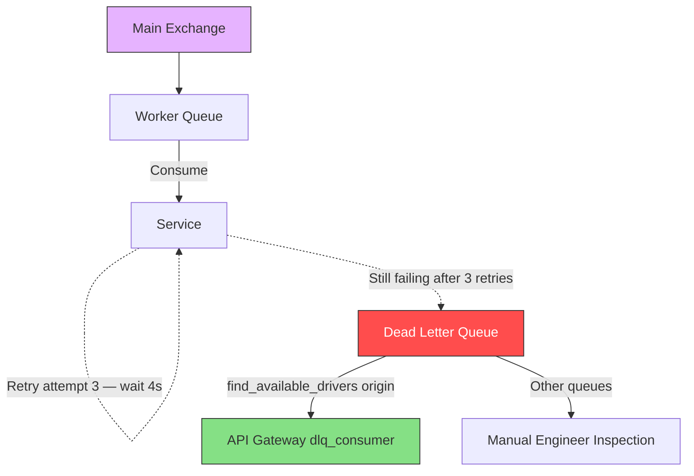
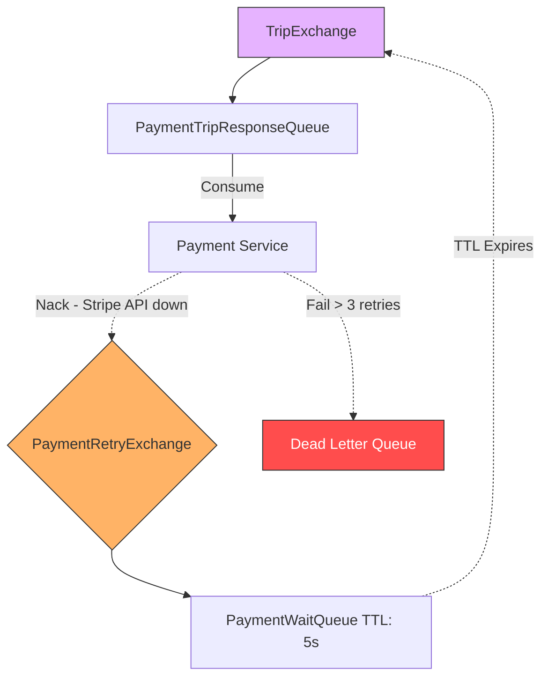

# Reliability

The Hybrid Logistics Engine uses a multi-layered approach to ensure no events are silently lost and that rider-facing timeouts are handled gracefully.

## 1. Message Retries & Dead Letter Queue (DLQ)

In a distributed, event-driven system, messages inevitably fail to process — a database may be momentarily locked, or an external API might rate-limit. The system must guarantee that **no trip or payment event is lost**.

### The Problem with Naive Consumers

By default, if a consumer throws an error:
- With `auto-ack`: The message is deleted and lost forever.
- With `Nack(requeue=true)`: The message immediately goes back to the top of the queue, creating an infinite retry loop — a classic "poison message" problem.

### The Retry Flow

The retry logic lives entirely in Go inside `shared/retry/retry.go` — there is **no** separate RabbitMQ `RetryExchange` or `WaitQueue`. The `ConsumeMessages` wrapper calls `retry.WithBackoff` around every handler:

```go
cfg := retry.DefaultConfig()
// MaxRetries: 3, InitialWait: 1s, MaxWait: 10s

err := retry.WithBackoff(ctx, cfg, func() error {
    return handler(ctx, d)
})
```

**Step-by-step flow for a failing message:**

1. **Attempt 1** — Handler runs. DB is locked → returns error.
2. **Wait 1s** — `time.After(1s)` fires. Handler retried.
3. **Attempt 2** — Still failing → wait doubles to **2s**.
4. **Attempt 3** — Still failing → wait doubles to **4s**.
5. **Attempt 4 (final)** — Still failing → `retry.WithBackoff` returns the error.
6. **Rejection** — `d.Reject(false)` sends the message to the `DeadLetterExchange` → `dead_letter_queue`.

The backoff doubles each time, capped at `MaxWait: 10s`. Total worst-case retry window before DLQ: **~7 seconds** (1+2+4).

```go
// Inside shared/retry/retry.go
wait *= 2
if wait > cfg.MaxWait {
    wait = cfg.MaxWait // Caps at 10s
}
```

### The Dead Letter Queue (DLQ)

We can't retry forever. If a message payload is fundamentally malformed JSON, it will never succeed regardless of retries.

After `MaxRetries` (3) exhaustion, `d.Reject(false)` routes the message to the DLQ with failure context headers attached:

```go
if err != nil {
    headers["x-death-reason"] = err.Error()
    headers["x-retry-count"]  = cfg.MaxRetries
    _ = d.Reject(false) // → DeadLetterExchange → dead_letter_queue
}
```

**Characteristics of the DLQ in this system:**
- **Active consumer** (API Gateway): The `dlq_consumer` watches for messages originating from `find_available_drivers` and converts them to rider WebSocket alerts.
- **Persistence**: All other dead-lettered messages (payment, trip events) sit indefinitely with their `x-death-reason` header for engineer inspection via the RabbitMQ Management UI.
- **Manual Recovery**: Engineers can inspect the raw payload, fix the code, and republish the message to the correct exchange via an admin script or the RabbitMQ UI.

### Summary Topology



### Ideal Pattern for Financial Events (Broker-Level Retry)

The in-process backoff approach works well for most events. However, for high-stakes financial messages (like `PaymentCmdCreateSession`), a more resilient production-grade alternative is **broker-level retry** using a dedicated RabbitMQ `RetryExchange` and `WaitQueue`. This is the pattern the Payment Service would ideally use:

**How it would work:**
1. **Failure** — The Payment Service fails to reach the Stripe API. It `Nack(requeue=false)` the message.
2. **DLX Bounce** — The `PaymentTripResponseQueue` is configured with `x-dead-letter-exchange` pointing to a `PaymentRetryExchange`.
3. **Wait Queue** — The `PaymentRetryExchange` routes the message to a `PaymentWaitQueue` with `x-message-ttl: 5000ms` and **no consumers**.
4. **Resurrection** — After 5 seconds the message expires in the `WaitQueue`. A second DLX routes it back to the original `TripExchange`.
5. **Retry** — The Payment Service receives the message again and reattempts the Stripe call.



> [!IMPORTANT]
> The key advantage over Go-level backoff is **crash resilience** — if the Payment Service pod restarts mid-backoff, the message is safely preserved in the broker's `PaymentWaitQueue` rather than lost in-memory. For a production payment system, this is the recommended approach.

See the [Payment Service reliability notes](../payment-service/overview#reliability-note) for context on the current implementation.

---

## 2. Trip Request TTL & DLQ Workflow

To ensure riders aren't left waiting indefinitely, driver search requests have a strict time limit enforced natively by the message broker.

### Queue Configuration

The `find_available_drivers` queue is declared with:
- **`x-message-ttl`**: `120000` (120 seconds). Any unprocessed message is automatically moved after this window.
- **`x-dead-letter-exchange`**: `dlx`. This exchange handles redirected "dead" messages.

### DLQ Termination — Three Paths

Messages reach the DLQ via three distinct paths:

| Trigger | Error | Outcome |
|---|---|---|
| All matching drivers rejected the ride | `exhausted_all_drivers` | AMQP Reject → DLQ |
| 12-driver retry cap reached | `max_driver_retries_reached` | AMQP Reject → DLQ |
| Message sat in queue for 120s with no ACK | Broker TTL expiry | Broker moves to DLQ |
| Rider increased fare — old payload is stale | `outdated_fare` | AMQP Reject → DLQ (silently) |

In all cases, the API Gateway's `dlq_consumer` identifies whether the dead-lettered message originated from `find_available_drivers` (via `x-death` headers) and sends a `TripEventNoDriversFound` WebSocket alert to the rider's frontend.

```go
func isDriverSearchTTLExpired(d amqp.Delivery) bool {
    // ...
    return (reason == "expired" || reason == "rejected") && queue == messaging.FindAvailableDriversQueue
}
```

### Rider Experience

On the frontend, the rider sees a live 120-second countdown timer. When the DLQ triggers:
1. The UI switches to the "No drivers found" screen.
2. The rider is prompted to either **Cancel** or **Increase Fare** to restart a fresh search.

> [!NOTE]
> Only the DLQ triggers the "No drivers found" notification — no service manually publishes this event. This ensures architectural consistency.

---

## 3. Quality of Service (QoS)

To ensure fair message consumption across horizontally scaled containers (e.g., three instances of `trip-service` running simultaneously), consumers restrict their prefetch to exactly **1 message at a time**:

```go
err := r.Channel.Qos(
    1,     // prefetchCount: Limit to 1 unacknowledged message per consumer
    0,     // prefetchSize: No limit on message size
    false, // global: Apply per consumer, not per channel
)
```

This prevents a single fast instance from hoarding messages while others remain idle.
