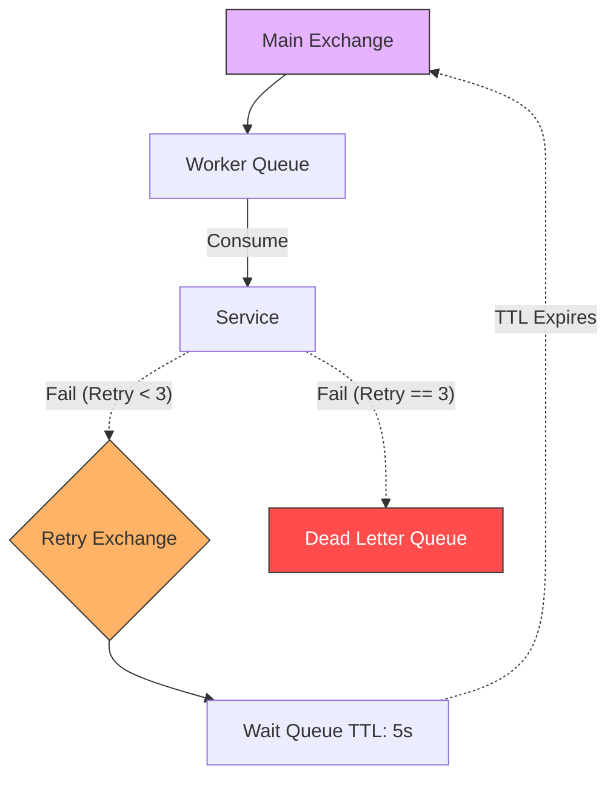

# Reliability: Message Retries and Dead Letter Queues

In a distributed, event-driven system like the Hybrid Logistics Engine, messages inevitably fail to process. A database might be temp-down, an external API could rate-limit us, or a bug might cause a panic. 

We must guarantee that **no trip or payment events are lost**. To achieve this, we implement a robust Retry & Dead Letter Queue (DLQ) topology in RabbitMQ.

## 1. The Problem with Naive Consumers

By default, if a consumer service throws an error while handling a RabbitMQ message:
- If `auto-ack` is on: The message is deleted and lost forever.
- If it `Nack(requeue=true)`s: The message goes straight back to the top of the queue and is immediately consumed again, resulting in an infinite loop of failures (a "poison message").

## 2. Implementing Retries with TTL

To prevent infinite loops, we do not simply `requeue=true`. Instead, we route failed messages to a dedicated **Retry Exchange**.

### The Flow:
1. **Initial Failure**: The `Trip Service` consumes a `PaymentEventSuccess` message but the DB is locked. It `Nacks` the message with `requeue=false`.
2. **First DLX Bounce**: The main queue is configured with an `x-dead-letter-exchange` pointing to a `RetryExchange`.
3. **The Wait Queue**: The `RetryExchange` routes the message to a `WaitQueue`. This queue has NO consumers attached to it. However, it has an `x-message-ttl` (Time To Live) set (e.g., 5000ms).
4. **Resurrection**: Once the 5 seconds expire, the message "dies" in the `WaitQueue`. It is then bounced by *another* DLX back into the ORIGINAL main exchange.
5. **Retry**: The `Trip Service` receives the message again. 

## 3. The Dead Letter Queue (DLQ)

We can't retry forever. What if the message payload is fundamentally malformed JSON? It will never succeed.

We track the number of retry attempts (often using RabbitMQ's `x-death` headers). If a message fails after **3 retries**, we `Nack(requeue=false)` it *again*, but we explicitly publish it to a final destination: the **Dead Letter Queue (DLQ)**.

### Characteristics of the DLQ:
- **No active consumers**: Messages sit here indefinitely.
- **Alerting**: A separate monitoring service (like Datadog or a custom PromQL alert) watches the queue length. If `DLQ length > 0`, it pages an engineer.
- **Manual Intervention**: Engineers can inspect the raw payload in the RabbitMQ UI, fix the code bug, and manually shunt the messages back into the main exchange via an admin script.

## 4. Summary Topology

