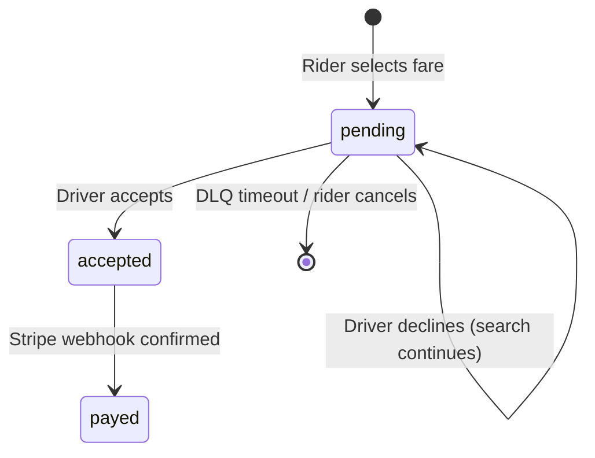

# Trip Service

The Trip Service is the authoritative source of truth for every trip's state. It owns all MongoDB trip records, the pricing engine, OSRM route fetching, and the gRPC API exposed to the API Gateway.

## 1. OSRM Routing Engine

Trip distances and ETAs are calculated using the Open Source Routing Machine (OSRM) HTTP API, ensuring pricing is based on real-world road networks.

### Fetching the Route (with Context Propagation)

The `GetRoute` method in `service.go` builds a coordinate waypoint URL and makes an HTTP request. The call uses `http.NewRequestWithContext` so that if the rider cancels their preview, the outbound OSRM network call is **immediately terminated** rather than waiting for the 10s wall-clock timeout:

```go
url := fmt.Sprintf("%s/route/v1/driving/%s?overview=full&geometries=geojson", baseURL, waypointStr)

req, err := http.NewRequestWithContext(ctx, http.MethodGet, url, nil)
if err != nil {
    return nil, fmt.Errorf("failed to create OSRM request: %w", err)
}
client := &http.Client{Timeout: 10 * time.Second}
resp, err := client.Do(req)
```

Both cancellation paths (rider disconnect → `context.Canceled` and OSRM hang → `10s timeout`) are handled by the same error path.

### Graceful Degradation

The `useOSRMApi bool` parameter allows the system to fall back to a mock 5km / 10min response if the OSRM vendor is unreachable, preventing the entire dispatch system from going offline:

```go
if !useOSRMApi {
    return &tripTypes.OsrmApiResponse{ /* 5km default */ }, nil
}
```

### Parsing the Response

The body is unmarshaled into `tripTypes.OsrmApiResponse`:

```go
body, err := io.ReadAll(resp.Body)
if err != nil {
    return nil, fmt.Errorf("failed to read OSRM response body: %w", err)
}

var routeResp tripTypes.OsrmApiResponse
if err := json.Unmarshal(body, &routeResp); err != nil {
    return nil, fmt.Errorf("failed to parse OSRM response: %w", err)
}
return &routeResp, nil
```

The underlying struct in `services/trip-service/pkg/types/types.go` captures the key properties used by the pricing engine and the frontend map polyline renderer:

```go
type OsrmApiResponse struct {
    Waypoints []struct {
        Location []float64 `json:"location"` // [lon, lat] of each waypoint
    } `json:"waypoints"`
    Routes []struct {
        Distance float64 `json:"distance"` // meters
        Duration float64 `json:"duration"` // seconds
        Geometry struct {
            Coordinates [][]float64 `json:"coordinates"` // [lon, lat] pairs for polyline
        } `json:"geometry"`
    } `json:"routes"`
}
```

The struct also exposes a `ToProto()` method that converts the raw OSRM response to a protobuf `Route` message. For carpool trips with multiple waypoints, it splits the geometry array into per-segment legs — one per rider stop — to support accurate multi-leg route rendering on the driver's map.

---

## 2. Pricing Engine

The Trip Service automatically calculates upfront fares across **five** vehicle packages before the rider commits to a trip.

### Base Packages

Prices are stored in cents to prevent floating-point precision errors:

| Package | Base Price (cents) | Notes |
|---|---|---|
| `suv` | 200 | — |
| `sedan` | 350 | — |
| `van` | 400 | — |
| `luxury` | 1000 | — |
| `carpool` | 350 (base) | **50% discount applied** |

### Dynamic Fare Calculation

The base price is combined with OSRM's distance and duration to form the final fare:

```go
distanceFare := distanceKm * pricingCfg.PricePerUnitOfDistance
timeFare     := durationInMinutes * pricingCfg.PricingPerMinute
totalPrice   := carPackagePrice + distanceFare + timeFare

if f.PackageSlug == carpoolPackageSlug {
    totalPrice *= 0.5 // 50% carpool discount
}
```

Fares are persisted to MongoDB's `ride_fares` collection immediately, preventing users from spoofing API values for a cheaper ride.

### Fare Ownership Validation

Before a trip can start, `GetAndValidateFare` verifies the fare record belongs to the requester's `userID`, preventing a user from hijacking another rider's fare token.

---

## 3. Trip State Machine

The Trip Service is the sole authority for a trip's lifecycle status in MongoDB.



### State Transitions

| Status | Trigger | Side Effects |
|---|---|---|
| `pending` | `CreateTrip` called | Trip created, driver search begins |
| `accepted` | Driver accepts via AMQP | `TripEventDriverAssigned` + `PaymentCmdCreateSession` published |
| `payed` | `PaymentEventSuccess` consumed | Trip finalized, driver seats updated |

### Increase Fare Guard

`IncreaseTripFare` includes strict validation to ensure the operation is safe — it rejects if the trip is already accepted, has a driver assigned, or has no fare attached:

```go
if trip.Status != "pending" {
    return nil, fmt.Errorf("trip is not pending")
}
if trip.Driver != nil {
    return nil, fmt.Errorf("driver already assigned")
}
```

When fare is increased successfully, the database is updated atomically across both `ride_fares` and the embedded `trip.rideFare` record. The Driver Service then detects this price bump on the next search pass and rejects any older lower-fare AMQP payloads to the DLQ.

---

## 4. gRPC and HTTP Multiplexing

The Trip Service serves both `HTTP/1.1` health checks and `HTTP/2` gRPC traffic on a **single unified port** using `golang.org/x/net/http2/h2c`.

### Protocol Sniffing

The `h2c` handler inspects the `ProtoMajor` version and `Content-Type` header to route traffic:

```go
h2Handler := h2c.NewHandler(http.HandlerFunc(func(w http.ResponseWriter, r *http.Request) {
    if r.ProtoMajor == 2 && strings.HasPrefix(r.Header.Get("Content-Type"), "application/grpc") {
        grpcServer.ServeHTTP(w, r)
    } else {
        mux.ServeHTTP(w, r) // Health checks, /trips/ HTTP endpoint
    }
}), &http2.Server{})
```

> [!TIP]
> This allows Kubernetes readiness/liveness probes to safely query `:8080/` over HTTP while allowing the API Gateway's internal gRPC clients to connect to the exact same port over HTTP/2.

### HTTP Endpoints (non-gRPC)

The Trip Service also exposes plain HTTP routes used internally by the Driver Service:

| Endpoint | Purpose |
|---|---|
| `GET /trips/{tripID}` | Used by Driver Service to validate trip state and current fare during dispatch loops |
| `POST /fares/update-seats` | Decrements/restores carpool seat counts when a driver accepts or cancels |
