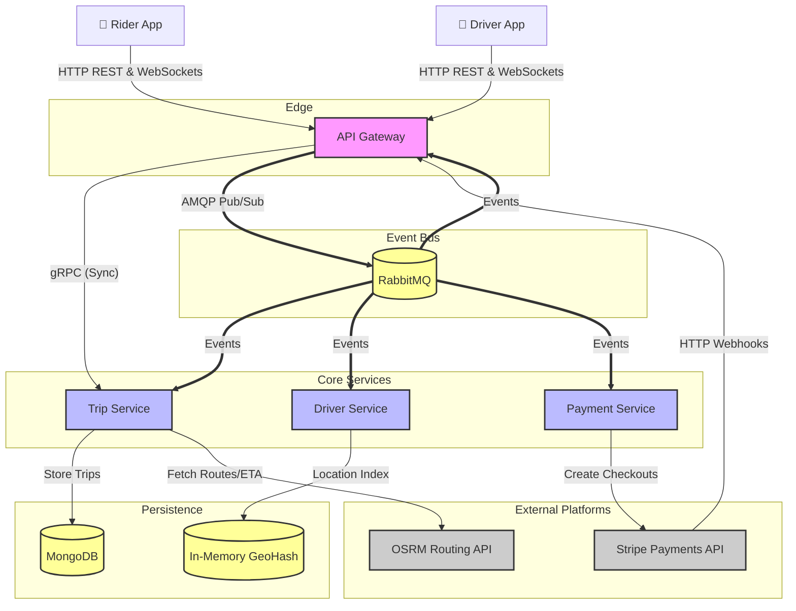
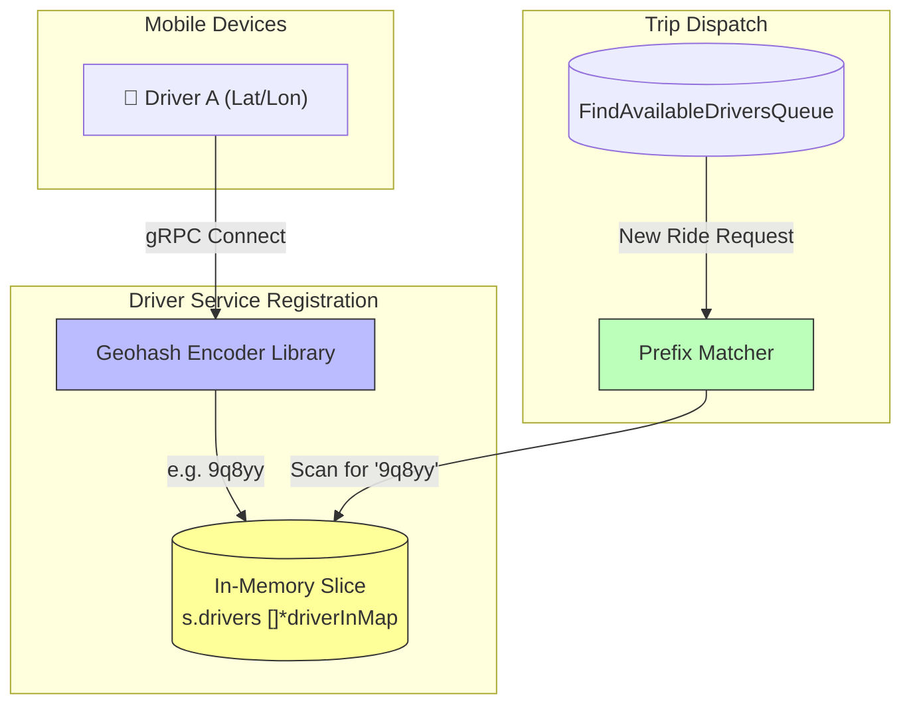
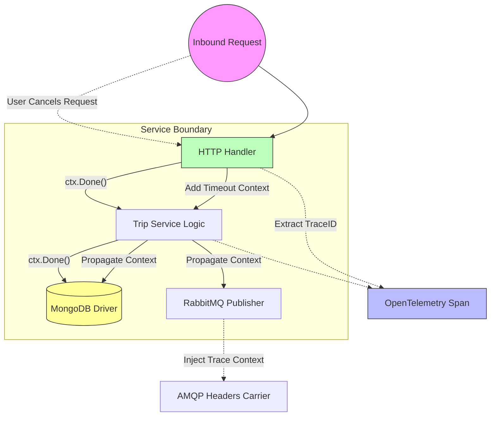

# Hybrid Logistics Engine

> **Note:** For setup instructions, technology stack, and implementation details, please see the [Technical Assessment](technical-assessment.md).

A real-world ride-sharing platform built with modern microservices architecture. Think of it as a simplified Uber backend—connecting riders with drivers in real-time, calculating routes, handling payments, and managing the entire trip lifecycle.

## Project Demo

[Watch the demo](https://github.com/user-attachments/assets/73bcc4b213bf436091b99df93facfa06.mp4)

## System Objectives

This repository demonstrates the orchestration of a scalable ride-sharing platform leveraging modern backend technologies. The core functional requirements include:
- Finds nearby available drivers using smart location tracking
- Calculates the best route and estimates the fare
- Assigns a driver and keeps everyone updated in real-time
- Processes payments securely when the trip is complete

**Core Architecture:**
- 4 independent microservices (API Gateway, Trip Service, Driver Service, Payment Service)
- Real-time client state synchronization via WebSockets
- Resilient message queue event-driven communication
- High-performance routing calculation using OpenStreetMap REST interactions
- Secure transactional processing via Stripe Webhooks

## System Workflow

### High-Level Data Flow

The following describes the standard "Happy Path" orchestration lifecycle:

1. **Client Request Initialization**: Web App triggers initialization via API Gateway.
2. **Gateway Proxy**: API Gateway conducts auth/validation and proxies synchronous requests to internal sub-services.
3. **Trip Generation**: Core Trip Service generates OSRM route data and creates mathematical pricing models.
4. **Driver Dispatch**: Driver Service parses geolocation algorithms to match subset package pools.
5. **Event-Driven Broker**: RabbitMQ serves as the standard AMQP event bus ensuring eventual consistency without synchronous blocking.
6. **Payment Finalization**: Third-party checkout orchestration is completed natively.

### Service Breakdown

#### **API Gateway** (Port 8081)
Acts as the single external entry point exposing REST endpoints over HTTP/1.1 and WebSockets. It handles origin authentication, rate limiting, CORS configuration, and acts as a strict proxy routing internal traffic via gRPC boundaries to backend subnets.

#### **Trip Service** (gRPC Port 9093)
Operates as the Domain Logic Hub. When a synchronous gRPC request arrives, the service acts as a mediator interfacing dynamically with external OpenStreetMap data to generate dynamic vehicle pricing (SUV, Sedan, Van, Luxury) and persists the canonical state of a trip via the Repository pattern to MongoDB.

#### **Message Reliability & AMQP**
The system guarantees consistency by strictly executing "Dead Letter Queue" (DLQ) topology mappings over default queues. Any failed exponential retry loop correctly drops off to isolated failure tracking ensuring consumer queue depths remain resilient under pressure.

```mermaid
graph TD
    subgraph Exchanges
        TE[TripExchange]
        DLX[DeadLetterExchange]
    end

    subgraph Service Consumers
        AG[API Gateway]
        DS[Driver Service]
        TS[Trip Service]
        PS[Payment Service]
    end

    subgraph Queues
        Q1[FindAvailableDriversQueue]
        Q2[DriverCmdTripRequestQueue]
        Q3[DriverTripResponseQueue]
        Q4[PaymentTripResponseQueue]
        Q5[NotifyPaymentSessionCreatedQueue]
        Q6[NotifyPaymentSuccessQueue]
        Q7[NotifyTripCreatedQueue]
    end

    %% Fanout from TripExchange
    TE --> |"contracts.TripEventCreated"| Q1
    TE --> |"contracts.TripEventCreated"| Q7
    TE --> |"contracts.DriverCmdTripRequest"| Q2
    TE --> |"contracts.*TripAccept/Decline"| Q3
    TE --> |"contracts.PaymentCmdCreateSession"| Q4
    TE --> |"contracts.PaymentEventSessionCreated"| Q5
    TE --> |"contracts.PaymentEventSuccess"| Q6

    %% Consumption
    Q1 --> DS
    Q2 --> AG
    Q3 --> TS
    Q4 --> PS
    Q5 --> AG
    Q6 --> TS
    Q7 --> AG

    %% DLX Retry Policy
    Q1 -.-> |"Reject(requeue=false)"| DLX
    Q2 -.-> DLX
    Q3 -.-> DLX
    Q4 -.-> DLX
    Q5 -.-> DLX
    Q6 -.-> DLX

    style TE fill:#e6b3ff,stroke:#333,stroke-width:2px
    style DLX fill:#ffb366,stroke:#333,stroke-width:2px
    style Queues fill:#85e085,stroke:#333,stroke-width:2px
```

#### **Driver Service** (gRPC Port 9092)
Responsible for maintaining volatile in-memory index maps scaling heavily towards concurrent reads utilizing geohash spatial algorithms. It consumes active driver connections natively via WebSockets routing and determines fairness allocation.

#### **Web Frontend** (Port 3000)
A responsive Next.js SPA acting as the client abstraction layer driving simulated coordinate interactions to the API backend.

### Shared Infrastructure Resources

- **RabbitMQ**: Message bus executing Publisher/Consumer routing.
- **MongoDB**: Primary persistence Datastore isolated across individual microservice boundaries.
- **Jaeger/OpenTelemetry**: Distributed Application Performance Monitoring (APM) trace collector mapping context propagation across gRPC, HTTP, and RabbitMQ headers.
- **Tilt**: Container orchestrated micro-scaling development operations.

## Key Architectural Features

### Asynchronous Event Consistency
Inter-system reliance shifts natively towards asynchronous queues where available. This unblocks critical domain execution sequences. We purposely prioritize **Eventual Consistency** to ensure the survival of the cluster; if internal networking drops during standard operations, AMQP connections store volatile memory data guaranteeing fulfillment processing automatically heals alongside the service.

### Bi-Directional WebSockets
WebSocket connections via the API Gateway remove the necessity for long-polling overhead, maintaining persistent connections spanning Rider map updates and Driver assignment prompts concurrently.

### Dynamic Pricing Module
The backend engine leverages the OSRM REST endpoint mathematically mapping coordinate polyline intersections generating precise physical distances which translate to algorithmic payload models depending on vehicle package constants natively executed inside `trip-service`.

### Thread-Safe Geohash Indexing
To avoid N+1 bottlenecks interacting across MongoDB, the Driver Service runs a pure spatial matching thread utilizing Geohash strings operating lock constraints via `sync.RWMutex` providing immediate constant time retrieval on nearest-driver mapping calculations.

### Distributed Observability
By natively inserting OpenTelemetry instrumentation down the networking chains, W3C TraceContext spans natively output to the Jaeger telemetry collector mapping physical waterfall traces of cross-system latency variables perfectly across disparate Dockerized containers.

### Resiliency Planning
Distributed system failures inherently involve unpredictable third-party API throttling (Stripe, OSRM) or unannounced container preemption processes:
- **Retry Mechanics**: Utilizing robust exponential backoff sequences spanning the message queue boundaries prevents simple timeout failures from wiping canonical state tracking processes.
- **Idempotency Standards**: Handling DLQ messages enforces standard database Upsert configurations eliminating data duplication regardless of processing counts.
- **Connection Governance (Graceful Shutdown)**: Utilizing robust OS Signal context timeout limitations prevents unclosed TCP/IP connections resulting in zero-downtime upgrades when processing CI deployments.

## Design Decisions & Trade-offs

### High-Concurrency Resource Scaling

**The Problem with Monolithic Architecture:**
Processing highly synchronous spikes across complex logic routines inside single instances naturally creates arbitrary throttling blockades. For example, extensive OSRM API map calculations would exhaust processor cycles while the internal asynchronous payment sessions sit entirely idle waiting.

**The Distributed Solution:**
Containerizing domains individually via microservices introduces targeted load-balancer scalability methodologies. When heavy geographic load generation hits the Driver nodes, scaling operations strictly execute on that explicit layer preserving generic cluster memory sizing definitions elsewhere.

- ✅ **Pros:** Isolated failure domains, targeted Kubernetes HPA configurations, logic domain ownership decoupling.
- ❌ **Cons:** Introduction of complex distributed consistency challenges, significant initial deployment configuration overhead.

### Schema Segregation Strategy

To avoid strict data coupling where shared modifications cascade fatal application execution failures outward blindly, all physical persistence domains operate entirely decoupled across microservices. The `Driver Service` stores configuration locally, the `Trip Service` stores trip state locally—communication relies entirely across abstracted data-transfer contracts via AMQP or gRPC bridging. 

- ✅ **Pros:** Complete logical domain independence facilitating faster CI development pacing securely.
- ❌ **Cons:** Complex implementation of transaction compensations alongside strict data aggregation limits across separate boundaries.

### Hybrid Communication Transport

**Synchronous Multiplexing (gRPC):**
Utilizes native Protobuf implementation structures executing strictly checked logic parsing between direct service bounds requiring prompt success feedback prior to execution progression. Leveraging `h2c` unifies the external REST definitions and internal static Protobuf connections to single HTTP/2 ports drastically removing arbitrary gateway configuration endpoints constraints.

**Message Polling (RabbitMQ):**
Eliminates downstream dependency cascade outages by actively disconnecting inter-service success loops generating native eventual execution handling inherently buffering system anomalies automatically alongside heavy load scenarios gracefully.

### API Edge Configuration

Security protocol boundaries remain universally managed securely via the singular `API Gateway` preventing exposure leaks. The Gateway utilizes standardized JWT verification validation operations combined strictly ignoring complex business domain aggregations internally operating strictly as an intelligent transport layer checking CORS origin whitelisting protocols explicitly spanning frontend connections securely.

### Clean Layering Abstraction

We use a 3-layer architecture in each service:

1. **Transport Layer** (Front Door) - Handles HTTP/gRPC, unpacks requests
2. **Service Layer** (Brains) - Business logic lives here, doesn't care how data arrived
3. **Repository Layer** (Storage) - Talks to databases, abstracts storage details

Implementing the active Repository layers inside local boundaries inherently isolates Database specific structures enforcing Dependency Inversion protocols seamlessly simulating internal functional execution logic completely removing MongoDB requirements natively alongside external integration boundaries automatically resolving mock tests securely.

---

**Built with ❤️ using**: Go · gRPC · RabbitMQ · MongoDB · Kubernetes · Next.js · TypeScript

## Deep Dive: System Design

For a deeper understanding of the patterns used in this project, we recommend the following articles:

- [Strangler Fig Application - Martin Fowler](https://martinfowler.com/bliki/StranglerFigApplication.html)
- [Microservices Architecture Patterns - Microservices.io](https://microservices.io/patterns/microservices.html)
- [Architecture Definition Process - Microservices.io](https://microservices.io/post/architecture/2023/02/09/assemblage-architecture-definition-process.html)
- [Microservices vs. Distributed Systems - GeeksforGeeks](https://www.geeksforgeeks.org/system-design/microservices-vs-distributed-system/)
- [The Twelve-Factor App Principles](https://12factor.net/)

