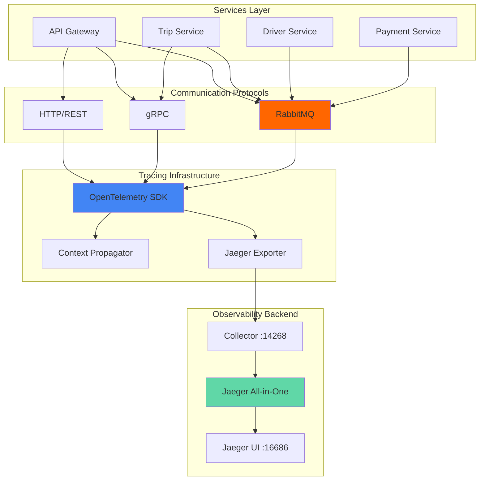
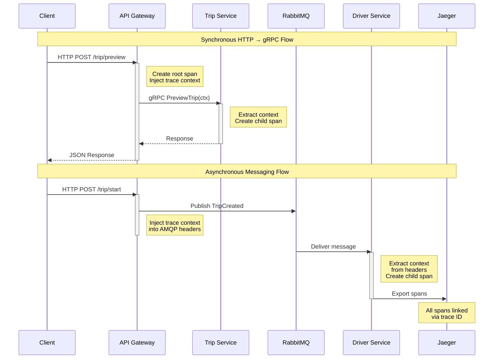

# Telemetry and Observability Documentation

> [!NOTE]
> This document provides comprehensive coverage of the distributed tracing and observability implementation in the ride-sharing microservices system using OpenTelemetry and Jaeger.

## Table of Contents

1. [Architecture Overview](#architecture-overview)
2. [Core Components](#core-components)
3. [Jaeger Setup](#jaeger-setup)
4. [OpenTelemetry Initialization](#opentelemetry-initialization)
5. [HTTP Instrumentation](#http-instrumentation)
6. [gRPC Tracing](#grpc-tracing)
7. [RabbitMQ Async Tracing](#rabbitmq-async-tracing)
8. [Integration Examples](#integration-examples)
9. [Configuration Guide](#configuration-guide)
10. [Troubleshooting](#troubleshooting)

---

## Architecture Overview

The ride-sharing application implements distributed tracing using **OpenTelemetry** (OTel) as the instrumentation framework and **Jaeger** as the tracing backend. This enables end-to-end observability across multiple microservices communicating via HTTP, gRPC, and RabbitMQ.

### High-Level Architecture



### Trace Context Propagation Flow



### Key Design Decisions

> [!IMPORTANT]
> **Context Propagation Across Async Boundaries**: The implementation uses custom AMQP header carriers to propagate trace context through RabbitMQ, maintaining trace continuity across asynchronous message flows.

> [!TIP]
> **Centralized Tracing Package**: All tracing logic is consolidated in [shared/tracing/](https://github.com/VijetaPriya47/Hybrid-Logistics-Engine/tree/main/shared/tracing) to ensure consistent instrumentation patterns across all services.

---

## Core Components

The telemetry implementation is organized into the following modules:

| Component | File | Purpose |
|-----------|------|---------|
| Core Tracer | [tracing.go](https://github.com/VijetaPriya47/Hybrid-Logistics-Engine/blob/main/shared/tracing/tracing.go) | Initializes OTel SDK, Jaeger exporter, and tracer provider |
| HTTP Instrumentation | [http.go](https://github.com/VijetaPriya47/Hybrid-Logistics-Engine/blob/main/shared/tracing/http.go) | Wraps HTTP handlers with automatic tracing |
| gRPC Instrumentation | [grpc.go](https://github.com/VijetaPriya47/Hybrid-Logistics-Engine/blob/main/shared/tracing/grpc.go) | Provides gRPC interceptors for client/server tracing |
| RabbitMQ Instrumentation | [rabbitmq.go](https://github.com/VijetaPriya47/Hybrid-Logistics-Engine/blob/main/shared/tracing/rabbitmq.go) | Custom trace context propagation for async messaging |

### Dependencies

```go
// OpenTelemetry Core
go.opentelemetry.io/otel v1.34.0
go.opentelemetry.io/otel/sdk v1.34.0
go.opentelemetry.io/otel/trace v1.34.0

// Jaeger Exporter
go.opentelemetry.io/otel/exporters/jaeger v1.17.0

// Auto-Instrumentation Libraries
go.opentelemetry.io/contrib/instrumentation/net/http/otelhttp v0.49.0
go.opentelemetry.io/contrib/instrumentation/google.golang.org/grpc/otelgrpc v0.59.0
```

---

## Jaeger Setup

Jaeger runs as a unified "all-in-one" deployment providing collection, storage, and UI in a single container.

### Kubernetes Deployment

#### Development Environment

[infra/development/k8s/jaeger.yaml](https://github.com/VijetaPriya47/Hybrid-Logistics-Engine/blob/main/infra/development/k8s/jaeger.yaml):

```yaml
apiVersion: apps/v1
kind: Deployment
metadata:
  name: jaeger
  labels:
    app: jaeger
spec:
  selector:
    matchLabels:
      app: jaeger
  template:
    metadata:
      labels:
        app: jaeger
    spec:
      containers:
        - name: jaeger
          image: jaegertracing/all-in-one:1.49
          ports:
            - containerPort: 16686 # UI
            - containerPort: 14268 # Collector HTTP
          env:
            - name: COLLECTOR_OTLP_ENABLED
              value: "true"
---
apiVersion: v1
kind: Service
metadata:
  name: jaeger
spec:
  selector:
    app: jaeger
  ports:
    - name: ui
      port: 16686
      targetPort: 16686
    - name: collector
      port: 14268
      targetPort: 14268
  type: ClusterIP
```

#### Production Environment

[infra/production/k8s/jaeger-deployment.yaml](https://github.com/VijetaPriya47/Hybrid-Logistics-Engine/blob/main/infra/production/k8s/jaeger-deployment.yaml) adds resource constraints:

```yaml
resources:
  requests:
    cpu: "250m"
    memory: "128Mi"
  limits:
    cpu: "500m"
    memory: "256Mi"
```

### Port Reference

| Port | Purpose | Protocol |
|------|---------|----------|
| 16686 | Jaeger UI | HTTP |
| 14268 | Collector HTTP endpoint | HTTP |
| 6831 | Thrift compact protocol (UDP) | UDP |
| 6832 | Thrift binary protocol (UDP) | UDP |

> [!TIP]
> Access the Jaeger UI at `http://jaeger:16686` within the cluster or via port-forwarding: `kubectl port-forward svc/jaeger 16686:16686`

---

## OpenTelemetry Initialization

### Tracer Configuration

The core initialization is handled by [InitTracer](https://github.com/VijetaPriya47/Hybrid-Logistics-Engine/blob/main/shared/tracing/tracing.go#L22-L41):

```go
package tracing

import (
    "context"
    "fmt"
    
    "go.opentelemetry.io/otel/exporters/otlp/otlptrace/otlptracehttp"
	"go.opentelemetry.io/otel/propagation"
	"go.opentelemetry.io/otel/sdk/resource"
	sdktrace "go.opentelemetry.io/otel/sdk/trace"
	semconv "go.opentelemetry.io/otel/semconv/v1.26.0"
)

// ... initialization logic (see tracing.go)
```

### The Decorator & Interceptor Patterns

To keep the business logic clean from instrumentation code, the system extensively uses the **Decorator Pattern** (wrapping HTTP and RabbitMQ handlers) and the **Interceptor Pattern** (for gRPC).

---

## HTTP Instrumentation

The `API Gateway` heavily relies on the `net/http` standard library. To trace incoming REST endpoints, we use `otelhttp` as a decorator:

```go
// shared/tracing/http.go
func WrapHandlerFunc(handler http.HandlerFunc, operation string) http.Handler {
	return otelhttp.NewHandler(handler, operation)
}
```

**Usage in API Gateway:**
```go
	mux.Handle("/trip/start", tracing.WrapHandlerFunc(handleTripStart, "POST /trip/start"))
```

## gRPC Tracing

For internal microservice communication (e.g., API Gateway talking to Trip Service), we use gRPC interceptors. The `otelgrpc` package handles injecting the trace context automatically into HTTP/2 metadata.

```go
// shared/tracing/grpc.go
func WithTracingInterceptors() []grpc.ServerOption {
	return []grpc.ServerOption{
		grpc.StatsHandler(newServerHandler()),
	}
}

func DialOptionsWithTracing() []grpc.DialOption {
	return []grpc.DialOption{
		grpc.WithStatsHandler(newClientHandler()),
	}
}
```

**Usage:**
```go
// Server side
grpcServer := grpc.NewServer(tracing.WithTracingInterceptors()...)

// Client side
conn, err := grpc.Dial(uri, grpc.WithTransportCredentials(insecure.NewCredentials()), tracing.DialOptionsWithTracing()[0])
```

## RabbitMQ Async Tracing

Handling async tracing requires manually propagating the `TraceContext` into AMQP message headers. The implementation leverages a custom `amqpHeadersCarrier` which implements OpenTelemetry's `TextMapCarrier` interface.

```go
// shared/tracing/rabbitmq.go
// 1. Inject before publishing
carrier := amqpHeadersCarrier(msg.Headers)
otel.GetTextMapPropagator().Inject(ctx, carrier)

// 2. Extract when consuming
carrier := amqpHeadersCarrier(delivery.Headers)
ctx := otel.GetTextMapPropagator().Extract(context.Background(), carrier)
```

By passing `ctx` derived from `Extract` down to the `handler`, any further spans created by the receiving microservice automatically link to the parent span that published the message.

---

## Integration Examples

Each microservice passes its specific `ServiceName` to the `tracing.InitTracer()` call during startup to properly identity itself inside Jaeger.

## Configuration Guide

The telemetry engine relies heavily on environmental configurations pointing to a centralized collector. 

```shell
export ENVIRONMENT="production"
export OTEL_EXPORTER_OTLP_ENDPOINT="http://jaeger:14268/api/traces"
```

## Troubleshooting

- **Missing Spans**: Ensure that the `Context` is always passed down as the first parameter. Doing `context.Background()` mid-flight will immediately break the trace chain.
- **Headers Dropped**: If using an intermediary message broker or an alternative API Gateway proxy, double-check that standard `traceparent` headers are not being forcefully stripped.

## OpenTelemetry Reference

- [Understanding Distributed Tracing - OpenTelemetry.io](https://opentelemetry.io/docs/concepts/observability-primer/#distributed-traces)
- [Getting Started with OpenTelemetry for Go](https://opentelemetry.io/docs/languages/go/getting-started/)

