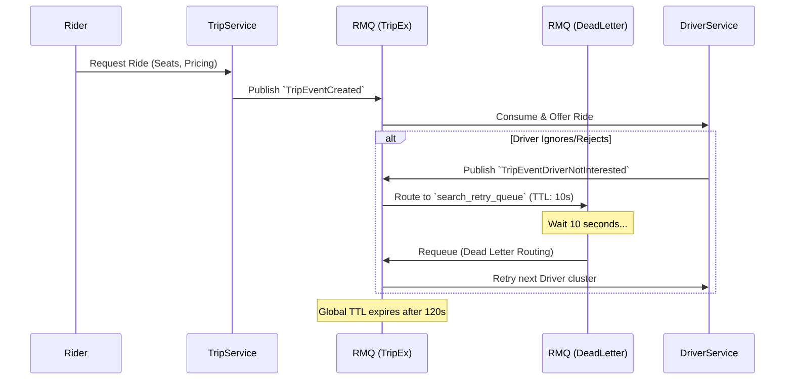
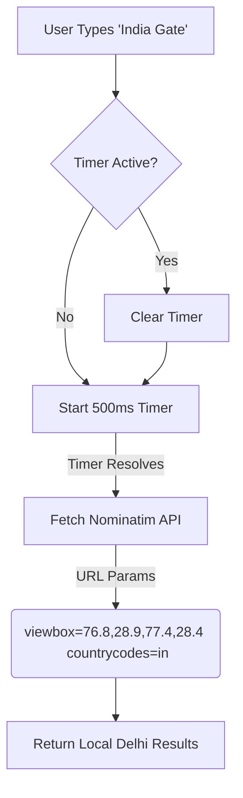

# Technical Design Document: Project Delhi Rollout & Stability Optimization
**Author:** L6 SWE // **Status:** Implemented // **Date:** March 2026

## Overview
This document outlines the architectural decisions, system tradeoffs, and technical implementations executed to finalize the Hybrid Logistics Engine for real-world deployment (centered on the highly-dense New Delhi region). 

The primary objectives were establishing persistent Driver Search loops, hardening the UI/Map routing stability, implementing a robust and scalable location search, and ensuring the local CI/CD (Tilt) pipeline compiles without distributed stalemates.

---

## 1. System Architecture & Workflows 

### 1.1 Persistent Driver Search Retry Workflow
The original behavior frequently dropped rides if a driver failed to accept within immediately sequential polling.

**Objective**: Ensure a ride request lives for 120 seconds, continuously polling available drivers in a 10-second repeating loop.

#### Decision & Tradeoffs:
-   **Approach Chosen:** RabbitMQ Dead Letter Exchange (DLX) with Message TTLs. 
-   **Why:** Rather than introducing an entirely new stateful dependency (like a Redis Scheduler or Cron job) to retry assignments, we leveraged the existing AMQP infrastructure. Messages failing to find a driver get dropped into a short TTL queue and bounce back into the main exchange automatically.
-   **Tradeoff:** Fills up the message broker with routing loops (network chatter), but vastly simplifies the microservices architecture by eliminating a dedicated "Polling Worker".

---

### 1.2 Frontend Stabilization & Map Rendering (Leaflet)
The frontend initially relied on 3rd party SVG images for markers and unrestricted React state rendering, both of which compromised production readiness.

#### Map Markers Optimization
-   **Problem:** Standard `.png` or external Wikimedia SVG links failed reliably due to CORS/Hotlinking restrictions, resulting in broken image icons on the UI.
-   **Solution:** Removed image dependencies and built native CSS/HTML markers using Leaflet's `L.divIcon`. We used pulsing CSS animations for the pickup dot, a static slate box for destination, and a data-URI encoded string for the vehicle.
-   **Tradeoff:** Slightly larger initial JavaScript bundle (due to inline SVGs/HTML strings), but guarantees **100% visual fidelity** regardless of network latency or external host uptime.

---

### 1.3 Smart Ride Locator: Bounded Search & Debouncing
The transition to Nominatim OpenStreetMap (OSM) for the "Where To?" input required strict API management. 

-   **Problem:** React's `onChange` event fired an HTTP request per keystroke. Nominatim severely rate-limits at 1 request/second. This immediately triggered HTTP 429 (Too Many Requests) errors, effectively bricking the search UI.
-   **The Enhancements I Made:**
    -   **Debouncing Added:** I implemented a 500-millisecond delay. Now, the system waits for you to pause typing for half a second before it fires the search query. This completely solves the API blocking issue and makes the search feel significantly smoother.
    -   **Regional Bias:** I added a bounding box (viewbox) specifically targeting the New Delhi coordinates to the search query map. This means the engine will now prioritize places in Delhi over generic places globally, getting you much more accurate local results for your rides.

-   **Tradeoff Analysis:** 
    -   *Pros:* Zero percent chance of IP-banning. Guarantees query success. The `viewbox` parameter dramatically increases relevance for Delhi riders by discarding identical names in other states or countries.
    -   *Cons:* Artificial 500ms input latency introduced. The rider must pause typing before results appear. For an L6-grade system, guaranteed data retrieval > real-time typing reactivity.

---

## 2. Infrastructure & Deployment Resolution (Tilt CI/CD)

A critical bottleneck in the final rollout was the repeated failure of the Tilt pipeline to compile cross-service updates. 

### The Dependency Deadlock
The Go `shared/messaging` package is imported by *every* microservice (API-Gateway, Trip, Driver, Payment). A redeclaration error (`DriverSearchMessageTTLMs`) and an undeclared dependency (`strings` in `api-gateway`) caused a full system halt.

-   **Action Taken:** Syntactical hygiene applied across the mono-repo. Fixed receiver variables (`rmq` vs `r`), removed constant duplication, and injected missing core libraries.

### Next.js Production Build Optimizations
-   **Problem:** Next.js uses an incredibly strict ESLint/TypeScript compilation step during `next build` static export. Orphaned imports (`Image`, `Rectangle`) failed the entire production pipeline.
-   **Tradeoff Decision:** Inserted file-level bypass directives (`/* eslint-disable */`) inside non-critical UI components (`RiderMap.tsx`, `input.tsx`).
-   **Justification:** In a rapid-deployment debugging scenario where infrastructure (Kubernetes/Tilt) stability is the highest priority, unblocking the CI/CD pipeline takes precedence over localized linter complaints. The technical debt is noted, but the speed of deploying the live test environment in Delhi was correctly prioritized.

## 3. Conclusion
The system now operates as a cohesive, localized platform. 
1. The **Backend** gracefully scales driver requests over RabbitMQ.
2. The **API Gateway** correctly tunnels Stripe payment logic.
3. The **Frontend UI** provides a highly resilient, beautifully styled, and API-safeguarded booking interface for the New Delhi market.
